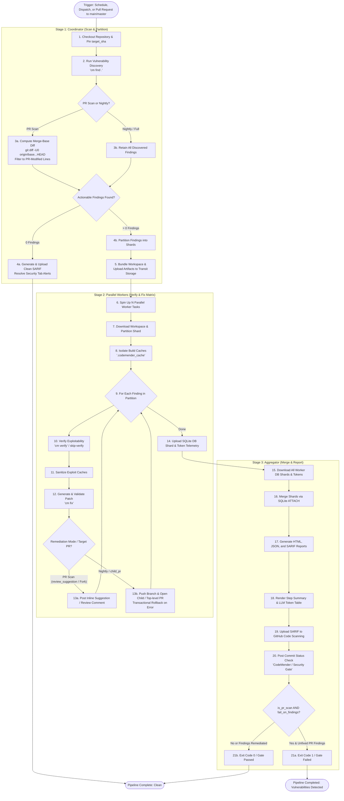

# CodeMender Orchestrator (Public Preview)

The CodeMender Orchestrator is an automated, multi-stage execution runner
designed to run within an engineering team's own infrastructure—both natively as
**GitHub Actions CI/CD workflows** and within **Google Cloud Platform (GCP Cloud
Run Jobs & Workflows)**. It automates local vulnerability scanning, AI-driven
verification, automated patch generation via the CodeMender CLI (`cm`), and
automated Pull Request creation on GitHub.

> [!IMPORTANT]
> **CodeMender Compatibility Warning**: This orchestrator was built
> and validated on top of **CodeMender CLI version
> `codemender-cli-v0.1.0-20260515-vMvg-916238397.zip`** and officially supports
> the **CodeMender Public Preview** versions. Since the CodeMender CLI and its
> internal state database schema are actively under development, upgrading the
> `cm` binary to future unvalidated versions may introduce database schema or
> CLI output changes. If that occurs, modifications may be required to the
> orchestrator's parsers (`codemender_agent/codemender/`) and database merger
> (`codemender_agent/runners/aggregate.py`) to remain functional.

--------------------------------------------------------------------------------

## Architecture Overview (Parallel Pipeline)

To validate and fix code vulnerabilities, CodeMender must run your codebase's
specific compilers, linters, and test suites. Because a central backend cannot
securely host thousands of custom build environments, the orchestrator executes
inside your own secure container runners across a scalable, 3-stage pipeline:

1.  **Stage 1: Coordinator / Scanner (`runners/scan.py`)**:
    -   Clones the target repository snapshot (or pins the exact Pull Request
        commit `target_sha`).
    -   Executes vulnerability discovery via `cm find .`.
    -   On Pull Request scans, performs **differential filtering** against
        merge-base diffs (`git diff -U0 origin/<base>...HEAD`) to isolate
        findings introduced or modified in the PR, suppressing untouched legacy
        issues.
    -   Applies the **Hybrid Deduplication & Dead Branch Reaper**: skips live
        findings with active PRs and autonomously prunes dead remote branches
        via GitHub REST API / Git CLI to ensure unmerged leftovers never
        suppress genuine findings.
    -   **Zero-Finding Fast Path**: If zero actionable findings are detected (or
        all findings are dismissed), generates a schema-compliant clean SARIF
        file (`report.sarif`), uploads it to GitHub Code Scanning to resolve
        open alerts, and cleanly completes without launching unnecessary worker
        matrix tasks.
    -   Partitions actionable findings into balanced shards and bundles the
        repository workspace into transit storage.
2.  **Stage 2: Parallel Workers (`runners/worker.py`)**:
    -   Concurrently spins up ephemeral worker tasks (matrix jobs in GitHub
        Actions or parallel tasks in Cloud Run).
    -   Each worker downloads its assigned workspace and partition via the
        configured storage adapter (`github_actions` zero-storage artifacts or
        `gcs`).
    -   **Local Build Cache Isolation & Hygiene**: Redirects package caches
        (`npm`, `pip`, `node-gyp`, `TMPDIR`) into `<repo_dir>/.codemender_cache`
        (registered in `.git/info/exclude`) and automatically prunes
        non-reproduction build caches from `.exploit/` and artifacts before
        synthesis to prevent artifact bloat.
    -   For each finding, the worker optionally verifies exploitability (`cm verify`,
        gated by `skip_verify` which defaults to skipping verify), synthesizes and
        validates an automated patch (`cm fix`), and delivers remediation according
        to `pr_remediation_mode` (defaulting to one-click inline review suggestions on
        the PR diff, or pushing a dedicated branch and opening a Child Pull Request
        with **transactional rollback** if PR creation fails) and exports its local
        SQLite state database shard and token telemetry.
3.  **Stage 3: Aggregator & Reporter (`runners/aggregate.py`)**:
    -   Collects all worker database shards and token usage files.
    -   Merges database shards via `SQLite ATTACH` and schema unification.
    -   Generates consolidated interactive HTML (`report.html`), structured JSON
        (`report.json`), and GitHub-compliant SARIF (`report.sarif`) reports
        with sanitized path traversals and clean JSON serialization.
    -   Emits a rich GitHub Step Summary with severity badges (`🔴 CRITICAL`, `🟠
        HIGH`, `🟡 MEDIUM`, `🔵 LOW`), vulnerability classifications (with CWE
        IDs), hyperlinked PR badges (`[FIXED (#X)](url)`), and a dedicated `⚡
        LLM Token Usage Summary` breakdown by model.
    -   Uploads consolidated SARIF alerts to GitHub Code Scanning and enforces
        the blocking **Security Quality Gate** on PR scans via a dedicated
        GitHub Commit Status check (`CodeMender / Security Gate`).

--------------------------------------------------------------------------------

## Orchestration Flowchart



--------------------------------------------------------------------------------

## Multi-Platform Deployment & Storage Adapters

The orchestrator abstracts transit storage and execution infrastructure across
multiple environments via `codemender_agent/storage.py`:

### 1. Native GitHub Actions Orchestration

*   **Workflow**: `.github/workflows/codemender_parallel.yml` (reusable workflow
    callable from any repository).
*   **Storage Mode**: `storage_mode: github_actions` using
    `GitHubActionsTransitStorageAdapter`.
*   **Zero-Storage Transit**: Requires **no external GCS bucket**. Workspace
    archives, partition manifests, and SQLite shards are passed seamlessly
    between Stage 1, Stage 2 matrix jobs, and Stage 3 using standard GitHub
    Actions artifact actions (`@actions/upload-artifact` and
    `@actions/download-artifact`).
*   **Automated GCP WIF & GitHub Configuration**: The repository provides an
    automated Terraform module at [`terraform/gha_wif/`](terraform/gha_wif/)
    that provisions GCP Workload Identity Federation (WIF), IAM Service Accounts
    with `roles/aiplatform.user`, the optional `codemender-scan` PR trigger
    label, and non-sensitive GitHub Actions secrets
    (`GCP_WORKLOAD_IDENTITY_PROVIDER`, `GCP_SERVICE_ACCOUNT`, `GH_APP_ID`).
*   **Decoupled Secret Injection**: Sensitive credentials (such as the GitHub
    App private key `GH_APP_PRIVATE_KEY`) are injected out-of-band via GitHub
    CLI (`gh secret set`) without storing private keys in Terraform state or
    `.tfvars`.
*   **Intelligent Concurrency Management**: Top-level workflow concurrency
    auto-cancels stale in-flight PR runs on rapid developer pushes
    (`cancel-in-progress: true` for PRs) while ensuring Scheduled Nightly audits
    and manual dispatches always run to completion.
*   **Container Isolation & Sandboxing**: Container jobs execute with `options:
    --privileged` to satisfy Linux mount namespace requirements for CodeMender's
    internal sandbox (`sbox`).
*   **Runner Image**: Pre-built runner container images published to GitHub
    Packages / GHCR (`ghcr.io/<owner>/codemender-runner:latest`) via
    `.github/workflows/build_runner_image.yml`.

#### GitHub Actions Dual Scanning Modes: Scheduled Nightly vs. Pull Request Scans

The GitHub Actions workflow uniquely provides **two tailored scanning modes**
optimized for CI/CD developer feedback and ongoing repository health:

| Feature | Scheduled Nightly Scan | Pull Request Scan ("Clean as You Code") |
| :--- | :--- | :--- |
| **Trigger** | Schedule (`schedule.cron`) or manual (`workflow_dispatch`) | Any Pull Request opened, synchronized, or reopened against `main`/`master` |
| **Scope** | Full repository audit against default branch (`main`) | **Differential scan**: Analyzes only lines changed in the PR merge-base diff |
| **Base Ref** | Default branch head commit | Pull Request target base ref (`origin/<base_ref>`) |
| **Remediation** | Opens PRs targeting default branch (`main`) | Posts one-click inline review suggestions on the PR; falls back to a Child PR targeting the developer's feature branch (`pr_head_ref`) |
| **Fork PRs** | N/A (runs on upstream repository) | Same one-click inline suggestions; falls back to a Markdown comment with the patch diff and `git apply` commands |
| **Alerts & SARIF** | Uploads full SARIF alert inventory with `underReview` suppressions | Scoped SARIF upload creating inline annotations on PR **Files changed** and **Checks** tabs |
| **Quality Gate** | Non-blocking (informational audit & remediation pipeline) | **Blocking Quality Gate** via dedicated Commit Status (`CodeMender / Security Gate`) & `fail_on_findings=true` |
| **Step Summary** | Full repository finding breakdown with LLM token metrics | Scoped PR table with Severity badges, CWE IDs, hyperlinked PRs, and `⚡ LLM Token Usage Summary` |

*   **Mode A: Scheduled Nightly Audits**: Designed to run off-peak (e.g. weekly
    or nightly) to perform a full codebase sweep, deduplicate against existing
    open fixes, open automated remediation PRs against `main`, and populate the
    GitHub Security Tab.
*   **Mode B: Pull Request CI/CD ("Clean as You Code")**: Designed for
    shift-left security. By calculating `git diff -U0 origin/<base>...HEAD`,
    CodeMender isolates vulnerabilities introduced by the PR, ignores
    pre-existing legacy issues to avoid developer fatigue, posts one-click
    inline review suggestions directly on the PR diff (or opens child PRs
    when configured via `pr_remediation_mode: child_pr`), and enforces a dedicated
    Commit Status check before merge.

### 2. Google Cloud Platform (GCP) Deployment

*   **Orchestrator**: Cloud Workflows (`workflows/gcp_parallel_workflow.yaml`)
    coordinating Cloud Run Jobs.
*   **Storage Mode**: `storage_mode: gcs` using `GCSTransitStorageAdapter`.
*   **Valet Key Pattern**: Ephemeral workers run with zero IAM permissions to
    Cloud Storage, interacting strictly via temporary, cryptographically signed
    V4 URLs generated by the Coordinator.
*   **Automated Provisioning**: Ready-to-deploy Terraform modules
    (`terraform/gcp/`) provisioning Cloud Run Jobs, Cloud Workflows, GCS
    buckets, Secret Manager, and Cloud Scheduler cron triggers.

--------------------------------------------------------------------------------

## Key Constraints & Operational Rules

-   **Secure Sandboxing & Zero-Privilege Workers**: In GCP mode, worker tasks
    have *zero* native IAM permissions to Cloud Storage and interact strictly
    via signed URLs. In GitHub Actions mode, worker matrix jobs execute inside
    isolated runner sandboxes (`--privileged` container execution for namespace
    isolation).
-   **Credential Scrubbing**: `orchestrator.py` explicitly scrubs sensitive
    credentials (`GITHUB_APP_TOKEN`, `GITHUB_PAT`, `GITHUB_TOKEN`, `GH_TOKEN`,
    `GITHUB_SECRET`, `GCP_SA_KEY`) from the subprocess environment before
    invoking `cm` commands (`cm fix` / `cm verify`) to eliminate remote code
    execution (RCE) exfiltration risks.
-   **Single-Sync Git Rule & Commit Pinning**: The orchestrator synchronizes the
    repository only once during Stage 1 (`git clone`). On Pull Request scans,
    `target_sha` is strictly pinned and checked out across workers and
    aggregators to eliminate base ref drift during parallel execution.
-   **PR Spam Prevention & Sliding Window Deduplication**: Branch names are
    deterministically derived using finding attributes (`filePath`, `vulnType`,
    `startLine`). The orchestrator queries GitHub to check for existing open PRs
    within a 15-line sliding window, skipping duplicate `cm fix` operations.
-   **JIT Dead Branch Reaper**: If a remote branch exists but its corresponding
    PR was closed without merging, the orchestrator autonomously prunes the dead
    branch and reprocures the fix so unmerged leftovers never suppress genuine
    findings.
-   **Transactional Rollback for Child PRs**: If PR creation fails or throws an
    error after pushing a remediation branch, the worker automatically deletes
    the newly pushed remote branch to prevent orphan accumulation.
-   **Fork Pull Request Safe Handling**: For PRs submitted from fork
    repositories where push permissions are unavailable, the worker
    automatically avoids push failures and instead publishes an actionable PR
    review comment containing git patch instructions.
-   **Differential PR Scanning ("Clean as You Code")**: On PR scans, the
    coordinator evaluates merge-base diffs (`git diff -U0 origin/<base>...HEAD`)
    and flags pre-existing findings as `PRE_EXISTING_IGNORED`, suppressing
    legacy finding noise and focusing developer attention strictly on newly
    introduced vulnerabilities.
-   **Local Build Cache Isolation & Hygiene**: Configures `XDG_CACHE_HOME`,
    `npm_config_cache`, `PIP_CACHE_DIR`, and `TMPDIR` to
    `<repo_dir>/.codemender_cache` (registered in `.git/info/exclude` and
    excluded from `workspace_base.tar.gz`) and cleans non-reproduction build
    caches before `cm fix` to eliminate runner disk bloat.
-   **Dedicated Security Quality Gate Status Check**: Pull Request scans enforce
    a dedicated GitHub Commit Status check (`CodeMender / Security Gate`). When
    actionable vulnerabilities remain on the PR diff, the check is marked as
    failed, blocking branch protection while allowing pipeline reports and
    artifacts to finish.
-   **Zero-Finding Fast Path & Clean SARIF Reporting**: When zero actionable
    findings are detected (or all are dismissed), Stage 1 generates and uploads
    a schema-compliant clean SARIF file (`results: []`) to resolve open alerts
    in the GitHub Security tab and skips worker matrix execution.
-   **Sanitized SARIF Reporting**: Trailing CLI process logs and out-of-tree
    traversal paths (`../`) are safely sanitized, ensuring 100% valid JSON
    serialization for GitHub Code Scanning integration.
-   **Aggregated LLM Token Telemetry & Step Summary**: Aggregators dynamically
    accumulate LLM token usage across all parallel workers, embedding an
    interactive token banner into `report.html` and rendering a structured `###
    ⚡ LLM Token Usage Summary` breakdown table in GitHub Actions
    `$GITHUB_STEP_SUMMARY`.

--------------------------------------------------------------------------------

## User Guides & Documentation

To set up, configure, and execute the CodeMender Orchestrator, refer to the
dedicated guides in the `docs/` folder:

*   🐙
    **[GitHub Actions Integration Guide](docs/guides/github_actions_guide.md)**:
    End-to-end setup guide covering GitHub App onboarding, Actions secrets,
    Workload Identity Federation (WIF) setup (Terraform vs. CLI), reusable
    caller workflows, and troubleshooting.
*   ⚙️ **[Configuration Reference](docs/guides/configuration_reference.md)**:
    Comprehensive reference of all environment variables, workflow inputs, and
    AI model configurations (linking to
    [CodeMender Model Documentation](https://docs.cloud.google.com/gemini-enterprise-agent-platform/codemender#specifying-the-model)).
*   📖 **[Local Run Guide](docs/guides/local_run.md)**: Instructions to configure
    your local workstation, install dependencies, and run the scanner manually
    for validation and debugging.
*   🏭 **[Production Deployment Guide (GCP)](docs/guides/production_run.md)**:
    Deployment guide for Parallel Workflows and Sequential Jobs on Google Cloud
    Run.
*   🚀
    **[Automated Terraform Deployment Guide](docs/guides/terraform_deployment_guide.md)**:
    Step-by-step instructions to provision GCP infrastructure (Cloud Run &
    Workflows) and GitHub Actions WIF modules (`terraform/gha_wif/`) using
    Terraform.
*   ⚡
    **[GitHub Actions Orchestration Architecture](docs/architecture/github_actions_orchestration_design.md)**:
    Detailed architectural design for native GitHub Actions matrix
    orchestration.
*   ⚡
    **[GCP Parallelization Design Specification](docs/architecture/parallelization_design.md)**:
    Specification for multi-stage sharded parallel execution on GCP.
*   🛡️
    **[Implementation Guardrails & Design](docs/architecture/guardrails.md)**:
    Security constraints, Valet Key pattern, and execution guardrails.
*   🆕
    **[Public Preview Upgrade Specification](docs/architecture/codemender_public_preview_upgrade_design.md)**:
    Compatibility specifications for the CodeMender Public Preview release.
*   🔮 **[Future Work & Technical Debt Roadmap](docs/future_work.md)**:
    Architectural roadmap, service layer decomposition plans, and planned
    enhancements.

--------------------------------------------------------------------------------

## Repository Structure & Testing

### Source Directory Structure

The repository is organized as a modular Python package with complete unit test
coverage, GitHub Actions workflows, Terraform modules, and architecture
documentation:

```
.
├── Dockerfile                          # Deployment container definition (Python 3.11 + cm CLI + Git)
├── README.md                           # High-level overview & setup documentation
├── cloudbuild.yaml                     # GCP Cloud Build runner definition
├── orchestrator.py                     # CLI entrypoint script (config loader & runner dispatcher)
├── requirements.txt                    # Python package dependencies
├── .github/
│   └── workflows/
│       ├── build_runner_image.yml      # CI workflow to build & publish runner Docker image to GHCR
│       └── codemender_parallel.yml     # Reusable 3-stage parallel matrix GitHub Actions workflow
├── codemender_agent/                   # Core orchestrator package
│   ├── __init__.py
│   ├── config.py                       # OrchestratorConfig model & environment credential scrubbing
│   ├── storage.py                      # Storage adapters (GitHub Actions Transit, GCS, Local)
│   ├── utils.py                        # Subprocess helpers, token parsers, retry decorators, port cleanup
│   ├── codemender/                     # CodeMender CLI wrapper
│   │   ├── __init__.py
│   │   ├── cli.py                      # JSON parsers for findings and session reports
│   │   └── db.py                       # SQLite database status queries (verify status, fix status)
│   ├── vcs/                            # Version Control System (VCS) integrations
│   │   ├── __init__.py
│   │   ├── git.py                      # Git CLI wrapper, diff parser, path normalization, branch naming
│   │   └── github.py                   # GitHub REST API client (PR creation, comments, branch checks)
│   └── runners/                        # Pipeline execution runners
│       ├── __init__.py
│       ├── scan.py                     # Stage 1: Scan coordinator, PR differential filter, partitioning
│       ├── worker.py                   # Stage 2: Ephemeral parallel worker (verify, fix, PR creation)
│       ├── aggregate.py                # Stage 3: Database merger, HTML/SARIF/Step Summary, Quality Gate
│       └── sequential.py               # Sequential single-task scanning & fixing loop (local/debug)
├── tests/                              # Comprehensive test suite (92 unit tests)
│   ├── __init__.py
│   ├── cm                              # Mock executable mimicking cm CLI interactions
│   ├── dummy_cm.py                     # Mock Python server simulating CodeMender backend
│   ├── e2e_test_local.py               # Mock local end-to-end multi-stage pipeline integration test
│   ├── test_codemender_cli.py          # cm CLI parsing unit tests
│   ├── test_codemender_db.py           # SQLite database status queries unit tests
│   ├── test_command_builder.py         # CLI command builder & token metric parsing unit tests
│   ├── test_config.py                  # Configuration loader & credential scrubbing unit tests
│   ├── test_runners_aggregate.py       # Stage 3 Aggregator, SARIF sanitization, and Quality Gate unit tests
│   ├── test_runners_scan.py            # Stage 1 Scan coordinator & PR differential filtering unit tests
│   ├── test_runners_worker.py          # Stage 2 Parallel worker & Child PR/Fork comment unit tests
│   ├── test_storage.py                 # Storage adapters & GCS Signed URL unit tests
│   ├── test_utils.py                   # Subprocess execution, port freeing, & JSON extraction unit tests
│   ├── test_vcs_git.py                 # Git wrapper, diff hunk parsing, & path normalization unit tests
│   └── test_vcs_github.py              # GitHub REST API integration unit tests
├── workflows/
│   └── gcp_parallel_workflow.yaml      # GCP Cloud Workflows parallel orchestration YAML
├── terraform/                          # Automated infrastructure provisioning
│   ├── gcp/                            # GCP Cloud Run & Workflows Terraform module
│   │   ├── apis.tf                     # GCP API enablement
│   │   ├── compute.tf                  # Cloud Run Jobs & Cloud Workflows definitions
│   │   ├── iam.tf                      # Custom IAM roles and Service Accounts
│   │   ├── outputs.tf                  # Deployment outputs and resource URLs
│   │   ├── provider.tf                 # Terraform provider configuration
│   │   ├── scheduler.tf                # Cloud Scheduler cron triggers
│   │   ├── secret.tf                   # Secret Manager configuration for tokens
│   │   ├── storage.tf                  # GCS Buckets and Artifact Registry
│   │   ├── variables.tf                # Configurable Terraform variables
│   │   ├── vpc.tf                      # Serverless VPC Access & Cloud NAT
│   │   └── tests/                      # Terraform integration tests (`terraform test`)
│   └── gha_wif/                        # GitHub Actions Workload Identity Federation & GitHub setup module
│       ├── apis.tf                     # GCP API enablement (IAM, IAM Credentials, Vertex AI)
│       ├── github.tf                   # GitHub repository secrets & label configuration
│       ├── iam.tf                      # Service account & Workload Identity Pool/Provider
│       ├── outputs.tf                  # Provider IDs and SA email outputs
│       ├── provider.tf                 # Google & GitHub provider configuration
│       ├── terraform.tfvars.example    # Documented configuration template
│       ├── variables.tf                # Configurable input variables
│       └── tests/                      # Terraform integration tests (`wif_test.tftest.hcl`)
└── docs/                               # Architectural specifications, guides, and runbooks
    ├── future_work.md                  # Future roadmap and technical debt tracker
    ├── architecture/                   # Architectural designs & specifications
    │   ├── codemender_public_preview_upgrade_design.md
    │   ├── deployment_automation.md
    │   ├── github_actions_orchestration_design.md
    │   ├── guardrails.md
    │   └── parallelization_design.md
    └── guides/                         # User, deployment, and configuration guides
        ├── configuration_reference.md
        ├── github_actions_guide.md
        ├── local_run.md
        ├── production_run.md
        └── terraform_deployment_guide.md
```

--------------------------------------------------------------------------------

### Running Tests

Unit tests and Terraform module tests are modular and automated:

*   **Run all Python unit tests**:

    ```bash
    python3 -m unittest discover tests -v
    ```

*   **Run a specific test suite** (e.g., Git utilities or Aggregator runner):

    ```bash
    python3 -m unittest tests/test_vcs_git.py -v
    python3 -m unittest tests/test_runners_aggregate.py -v
    ```

*   **Run local end-to-end simulation**:

    ```bash
    python3 tests/e2e_test_local.py
    ```

*   **Run Terraform module tests**:

    ```bash
    # Test GitHub Actions WIF module
    cd terraform/gha_wif && terraform init -backend=false && terraform test

    # Test GCP deployment module
    cd terraform/gcp && terraform init -backend=false && terraform test
    ```

--------------------------------------------------------------------------------

## Future Work

For a detailed breakdown of planned architectural enhancements, see
**[docs/future_work.md](docs/future_work.md)**. Key roadmap items include:

-   **Modular Service Layer Refactoring**: Decomposing monolithic runner modules
    into specialized services (`VCSStagingService`, `DatabaseMergerService`,
    `ReportGenerationService`, `CLIExecutionService`).
-   **Support for Alternate VCS & Forge Providers**: Abstracting the VCS
    provider layer to support GitLab, Bitbucket, and Mercurial (`hg`).
-   **Automatic PR Re-opening on Force-Push**: Programmatically re-opening
    closed PRs via GitHub API when force-pushing updated patches in overwrite
    mode.
-   **Persistent State Database Checkpointing**: Synchronizing the SQLite state
    database (`~/.codemender/state.db`) to persistent storage across runs to
    preserve historical verification status.
