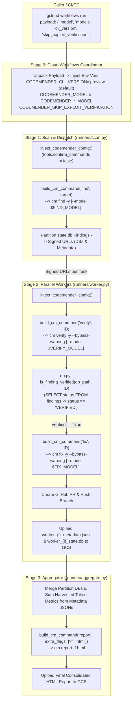

# CodeMender Orchestrator: Public Preview Upgrade Specification & Guardrails

This document serves as the absolute source of truth and architectural
guardrails for upgrading the **CodeMender Orchestrator** to support the
**CodeMender Public Preview** release while preserving complete backward
compatibility with internal/legacy releases within a **single codebase**.

--------------------------------------------------------------------------------

## 1. The Problem

Google is releasing **CodeMender Public Preview**, which introduces top-level
verification commands (`cm verify -y <FINDING_ID>`), mandatory pre-GA
interactive safety disclaimers (`--bypass-warning`), granular per-command AI
model selection (`--model`), and updated YAML configuration schemas. Enterprise
security teams need to upgrade their automated Cloud Workflows and Cloud Run
scanning pipelines to leverage these new capabilities without breaking existing
internal or legacy deployments. To ensure seamless adoption across diverse
environments, the CodeMender Orchestrator must support both Legacy and Public
Preview releases within a single, unified codebase.

--------------------------------------------------------------------------------

## 2. The Technical Plan

The CodeMender Orchestrator is a stateless, distributed orchestration layer
around the `cm` CLI binary and its SQLite state database
(`~/.codemender/state.db`). It executes across four major stages orchestrated by
**Cloud Workflows** and deployed on **Google Cloud Run**:

1.  **Stage 0: Cloud Workflows Coordinator**: Receives execution requests via
    JSON payloads (`gcloud workflows run ... --data='{...}'`), unpacks
    parameters (`cli_version`, `model`, `models`, `skip_exploit_verification`),
    and injects standardized environment variables into Cloud Run job
    containers.
2.  **Stage 1: Scan & Dispatch (`runners/scan.py`)**: Clones/syncs the target
    repository, configures `~/.codemender/config.yaml`, runs codebase
    vulnerability scans (`cm find`), partitions discovered findings, and
    generates signed GCS URLs for task partitions, mutated state DBs, and worker
    metadata.
3.  **Stage 2: Parallel Workers (`runners/worker.py`)**: Executes in parallel
    containers across finding partitions. Each worker verifies finding
    exploitability (`cm verify`), generates and applies security patches (`cm
    fix`), submits GitHub Pull Requests for remediations, and uploads partition
    DB shards and harvested token metadata to GCS.
4.  **Stage 3: Aggregation (`runners/aggregate.py`)**: Merges SQLite database
    partitions from all workers, aggregates harvested token consumption metadata
    from worker manifests, generates final HTML/JSON security reports (`cm
    report`), and uploads them to Google Cloud Storage.

### Universal Version Gating & Command Building

All version-dependent behavior across the Orchestrator is governed by an
explicit environment variable: **`CODEMENDER_CLI_VERSION`** (`"preview"` vs.
`"legacy"`). If unset, it defaults universally to **`"preview"`** across all
components, configuration injectors, and documentation.

-   A central command builder (`build_cm_command` in `utils.py`) constructs CLI
    argument lists dynamically based on `CODEMENDER_CLI_VERSION` (resolving from
    `os.environ` if omitted/defaulted) and resolved model flags.
-   In `"preview"` mode, positional targets and finding IDs are always appended
    at the **end** of the command string (e.g. `cm verify -y --bypass-warning
    <ID>`).
-   In `"preview"` mode, the command builder automatically injects mandatory
    pre-GA guardrail bypasses (`--bypass-warning`) strictly on commands that
    prompt for safety disclaimers (`cm verify` and `cm fix`), while injecting
    auto-approve flags (`-y`) across scanning, verification, and patching.
-   Model selection uses a hierarchical precedence engine: `CODEMENDER_MODEL`
    serves as the global default fallback, overridden by granular per-command
    variables (`CODEMENDER_FIND_MODEL`, `CODEMENDER_VERIFY_MODEL`,
    `CODEMENDER_FIX_MODEL`) if set.

### End-to-End System Architecture



--------------------------------------------------------------------------------

## 3. Alternatives (Considered & Ruled Out)

To serve as guardrails against future architectural drift or regression, the
following major design alternatives were evaluated and explicitly rejected
during engineering discussions:

### 1. Building and Deploying Separate Orchestrator Versions/Branches for Legacy vs. Public Preview

-   **What was considered:** Maintaining a `legacy` Git branch for internal
    deployments and a `main`/`preview` branch for Public Preview deployments.
-   **Why it was ruled out:** Maintaining multiple code branches duplicates
    CI/CD pipelines, splits bug fixes, and creates deployment drift. Because the
    differences between CodeMender releases are cleanly bounded to CLI argument
    syntax and optional flags, a single codebase with clean version gating
    (`CODEMENDER_CLI_VERSION`) is significantly simpler and more reliable.

### 2. Auto-Detecting CLI Capability/Version at Runtime

-   **What was considered:** Executing `cm --version` or probing `cm verify
    --help` at container startup to dynamically decide whether to invoke `cm
    verify -y <ID>` or legacy `cm find verify <ID> --yes`.
-   **Why it was ruled out:** Dynamic probing adds unnecessary startup latency,
    can fail in minimal container environments if version output formats change,
    and obscures deployment intent. Requiring an explicit environment variable
    (`CODEMENDER_CLI_VERSION="preview"|"legacy"`, defaulting to `"preview"`)
    makes version gating deterministic, inspectable, and explicit in
    Terraform/Workflows definitions.

### 3. Global Injection of `--bypass-warning` Across All CLI Commands

-   **What was considered:** Appending `--bypass-warning` to all CodeMender
    commands in `"preview"` mode, including `cm init`, `cm report`, and `cm
    clean`.
-   **Why it was ruled out:** We empirically verified that in CodeMender Public
    Preview, only `cm verify` and `cm fix` prompt for the pre-GA interactive
    safety disclaimer. Read-only and local utility commands (`cm report`, `cm
    init`, `cm clean`) do not emit the warning and reject the flag. Passing
    `--bypass-warning` globally causes standard CLI parsers to crash with
    `error: unknown flag: --bypass-warning`. We restrict `--bypass-warning`
    strictly to `verify` and `fix`.

### 4. Relying on SQLite `verified == 1` Integer Column or Assuming `status` Remains `'OPEN'` After `cm verify`

-   **What was considered:** Based on preliminary documentation listing only
    `OPEN`, `FIXED`, `DISMISSED`, and `REOPENED` finding states, we hypothesized
    that `cm verify` left `status = 'OPEN'` while toggling an integer column
    `verified = 1`.
-   **Why it was ruled out:** We empirically validated against live SQLite
    database dumps (`~/.codemender/state.db`) that when a finding is verified
    (even with `--skip-exploit-verification`), CodeMender explicitly promotes
    the finding's canonical `status` column from `'OPEN'` to `'VERIFIED'`.
    Checking `SELECT status FROM findings WHERE finding_id = ?` and verifying
    `status == "VERIFIED"` is authoritative across both Legacy and Public
    Preview releases, eliminating complex dual-column schema checks.

### 5. Passing `--compact` to Stream Live Token Usage in Cloud Run Logs

-   **What was considered:** Passing `--compact` on `cm find`, `cm verify`, and
    `cm fix` to view live rolling token tickers (`Tokens: 40k in / 12k out / 60k
    total`).
-   **Why it was ruled out:** In headless Cloud Run containers where standard
    output is captured by Google Cloud Logging, carriage-return tickers (`\r`)
    cannot overwrite terminal lines. Every update flush produces a brand new log
    entry, flooding log buckets with hundreds of repetitive lines per scan and
    burying debugging traces. We omit `--compact` and instead regex-harvest all
    completion lines (`✅ Completed X tool steps... | Tokens: 41k in / 561 out /
    42k total`) upon command exit.

--------------------------------------------------------------------------------

## 4. Detailed Implementation Plan

This section enumerates every single file in the repository that will be created or modified to implement the multi-version upgrade, along with precise rationale and behavioral specifications.

### 1. `codemender_agent/utils.py`

-   **Why change:** Shared subprocess execution and system utilities. Must
    become the single authority for CLI command argument building, input
    validation, model precedence resolution, metric parsing, and token usage
    harvesting.
-   **Detailed changes:**
    1.  Add `parse_token_metric(token_str: str) -> int`:
        -   Converts human-readable metric strings with SI suffixes into
            standard integers:
            -   `"41k"` or `"41K"` -> `int(float("41") * 1000)` = `41000`
            -   `"41.5k"` or `"41.5K"` -> `int(float("41.5") * 1000)` = `41500`
                (Uses `float()` cast before multiplication to prevent
                `ValueError` on decimal metrics)
            -   `"1.2M"` or `"1.2m"` -> `int(float("1.2") * 1000000)` =
                `1200000`
            -   `"1.5G"` or `"1.5g"` -> `int(float("1.5") * 1000000000)` =
                `1500000000` (Giga/Billions support for mega-context pipelines)
            -   `"561"` -> `561`
        -   Raises `ValueError` if the format is invalid or non-numeric.
    2.  Add `resolve_command_model(command_name: str) -> Optional[str]`:
        -   Implements a strict precedence hierarchy:
        -   Check granular override:
            `os.environ.get(f"CODEMENDER_{command_name.upper()}_MODEL")`
            (`CODEMENDER_FIND_MODEL`, `CODEMENDER_VERIFY_MODEL`,
            `CODEMENDER_FIX_MODEL`).
        -   If unset, fall back to global default:
            `os.environ.get("CODEMENDER_MODEL")`.
        -   If neither is set, return `None` (allowing the CLI binary to use its
            built-in default model).
    3.  Add `build_cm_command(cm_binary: str, action: str, target_or_id:
        Optional[str] = None, cli_version: Optional[str] = None, extra_flags:
        Optional[List[str]] = None) -> List[str]`:
        -   Centralizes all CodeMender command argument construction.
        -   **Dynamic Version Resolution:** If `cli_version` is `None` or
            omitted, `build_cm_command` dynamically resolves `cli_version =
            os.environ.get("CODEMENDER_CLI_VERSION", "preview").lower()`.
        -   **Input Validation Best Practice:** If `action` is one of `["find",
            "verify", "fix"]` and `target_or_id` is `None` or empty, raises a
            descriptive `ValueError(f"Action '{action}' requires a valid target
            or finding ID.")`. Filters all `None` entries from flag arrays to
            prevent `TypeError` when passed to `subprocess.Popen`.
        -   **Model Flag Gating:** `--model` flags are appended **strictly in
            `"preview"` mode**. In `"legacy"` mode, `--model` is omitted because
            legacy `cm` binaries do not support command-level `--model` flags
            and crash with unknown flag errors.
        -   **Positional Argument Order:** In `"preview"` mode, positional
            targets and IDs are placed at the **END** of the argument list:
            -   For `"find"`: Returns `[cm_binary, "find", "-y"]` + optional
                `["--model", model]` + `[target_or_id]`.
            -   For `"verify"`: Returns `[cm_binary, "verify", "-y",
                "--bypass-warning"]` + optional `["--model", model]` + optional
                `["--skip-exploit-verification"]` (if
                `CODEMENDER_SKIP_EXPLOIT_VERIFICATION` is `"true"`) +
                `[target_or_id]`.
            -   For `"fix"`: Returns `[cm_binary, "fix", "-y",
                "--bypass-warning"]` + optional `["--model", model]` +
                `[target_or_id]`.
            -   For `"init"`: Supports both standard `[cm_binary, "init"]` and
                `[cm_binary, "init", "--verify"]`.
            -   For `"report"`, `"clean"`: Appends `extra_flags` to base
                `[cm_binary, action]`.
        -   **In `"legacy"` mode (`cli_version == "legacy"`):**
            -   For `"find"`: Returns `[cm_binary, "find", target_or_id]`.
            -   For `"verify"`: Returns legacy syntax `[cm_binary, "find",
                "verify", target_or_id, "--yes"]`.
            -   For `"fix"`: Returns legacy syntax `[cm_binary, "fix",
                target_or_id, "--yes"]`.
    4.  Update `run_command(...)` for Token Harvesting:
        -   **Version-Gated Token Counting:** Check `CODEMENDER_CLI_VERSION`. In
            `"legacy"` mode, token harvesting is completely disabled
            (`token_usage = None`). Token counting is omitted entirely to
            preserve exact legacy output behavior without adding zero-token
            header noise.
        -   **Cumulative Multi-Turn Output Semantics:** In `"preview"` mode,
            during multi-step execution turns, CodeMender outputs completion
            lines formatted as: `Tokens: 41k in / 561 out / 42k total`. Each
            printed turn log line represents the **cumulative total usage** up
            to that point for the current command invocation.
        -   `run_command` executes: `matches =
            re.findall(r"Tokens:\s*([0-9.kMgG]+)\s*in\s*/\s*([0-9.kMgG]+)\s*out\s*/\s*([0-9.kMgG]+)\s*total",
            process.stdout)`
        -   If `matches` is non-empty, `run_command` parses the **LAST match**
            (`matches[-1]`) using `parse_token_metric` to capture the final
            cumulative total usage for that execution turn.
        -   If `matches` is empty, `token_usage` defaults safely to
            `{"in_tokens": 0, "out_tokens": 0, "total_tokens": 0}`.
        -   Attach `token_usage` object to the returned
            `subprocess.CompletedProcess`.

### 2. `codemender_agent/config.py`

-   **Why change:** Hides workspace initialization details and YAML config
    generation (`~/.codemender/config.yaml`). Must inject schemas compatible
    with both Legacy and Public Preview releases.
-   **Detailed changes:**
    1.  In `inject_codemender_config(repo_dir: str)`:
        -   Check `CODEMENDER_CLI_VERSION` from `os.environ`. Default to
            `"preview"` if unset across all execution paths.
        -   Read global config and merge repository-level `.codemender.yaml`
            first.
        -   **Execution Order Override:** Force `tools.confirm_commands = false`
            and `tools.confirm_writes = false` at the very end of
            `inject_codemender_config` **AFTER** repository `.codemender.yaml`
            is merged. This guarantees that headless execution safety rules
            cannot be overridden by repo-level configuration files.
        -   If `CODEMENDER_MODEL` is present in `os.environ`, inject `model:
            "<CODEMENDER_MODEL>"` at the root level of `config.yaml` as the
            workspace fallback model.

### 3. `codemender_agent/codemender/db.py`

-   **Why change:** SQLite database query helpers (`state.db`).
-   **Detailed changes:**
    1.  In `is_finding_verified(db_path: str, finding_id: str) -> bool`:
        -   Query `SELECT status FROM findings WHERE finding_id = ?`.
        -   Return `status == "VERIFIED"`.
    2.  **ISO 8601 Timestamp Verification:**
        -   Empirically verified against SQLite dumps that `created_at` and
            `updated_at` columns use standardized ISO 8601 UTC strings
            (`2026-08-05T00:42:19Z`).
        -   Standard SQLite string comparison (`WHERE excluded.updated_at >=
            main.updated_at`) operates 100% lexicographically correctly.

### 4. `codemender_agent/runners/scan.py`

-   **Why change:** Stage 1 runner responsible for initializing the workspace,
    executing `cm find`, filtering duplicate findings, uploading Stage 1
    metadata, and generating task partitions and GCS signed URLs.
-   **Detailed changes:**
    1.  In `_init_codemender`: Execute both `build_cm_command(cm_binary, "init",
        cli_version=cli_version)` and `build_cm_command(cm_binary, "init",
        extra_flags=["--verify"], cli_version=cli_version)`.
    2.  In `_scan_repository`: Replace inline scan calls with
        `build_cm_command(cm_binary, "find", target, cli_version=cli_version)`.
    3.  In `_filter_findings`:
        -   **PR Spam Prevention Status Enforcement:** When skipping findings
            matching existing remote branches or open PRs, set `status =
            'SKIPPED_DUPLICATE'`, `muted = 1`, and `mute_reason = 'Duplicate PR
            or branch already exists'` in `state.db`.
        -   Leaving `status = 'DISMISSED'` completely clean for user/manual
            dismissals without manual script manipulation.
    4.  In `_partition_findings`: Cap maximum task worker partitions to
        `min(active_findings, max_tasks, 10000)` to comply
        strictly with official GCP Cloud Run Job v2 task limit bounds (up to
        10,000 tasks max per job execution, as documented in Google Cloud Run
        Quotas & Limits).
    5.  In `_save_and_upload_state`:
        -   **Stage 1 Scan Metadata File:** Upload a dedicated
            `scan_metadata.json` file to GCS at
            `scans/{scan_id}/scan_metadata.json` containing Stage 1 scan token
            usage (`in_tokens`, `out_tokens`, `total_tokens`), total findings
            count, count of skipped duplicate findings (`SKIPPED_DUPLICATE`),
            and execution timestamps.
        -   Generate GET and PUT signed URLs for
            `scans/{scan_id}/worker_{i}_metadata.json` (`metadata_urls`).
        -   Include `metadata_urls` inside `manifest.json` alongside
            `partition_urls` and `upload_urls` so Stage 2 workers can upload
            execution metadata and harvested token counts to GCS.

### 5. `codemender_agent/runners/worker.py`

-   **Why change:** Stage 2 runner responsible for parallel vulnerability
    verification and remediation.
-   **Detailed changes:**
    1.  In `_process_finding`:
        -   **Early Idempotency & Task Retry Check:** Perform remote branch and
            open PR checks at the **very beginning** of `_process_finding`,
            *before* running `cm verify` or `cm fix`. If the remote branch
            already exists and its SHA matches local default branch HEAD +
            expected patch commit, or if an open PR already covers the finding,
            `_process_finding` sets `status = 'SKIPPED_DUPLICATE'` in `state.db`
            and returns early.
        -   Replace inline verification call with `build_cm_command(cm_binary,
            "verify", finding_id, cli_version=cli_version)` (with `finding_id`
            placed at the end).
        -   Replace inline fix call with `build_cm_command(cm_binary, "fix",
            finding_id, cli_version=cli_version)`.
        -   Preserve `git clean -fd -e .cm_project -e .exploit` intact.
    2.  In `run_worker_pipeline`:
        -   Safely parse `CODEMENDER_METADATA_URLS` JSON list and validate
            bounds against `worker_index`.
        -   After processing partition findings, record total harvested token
            counts (`in_tokens`, `out_tokens`, `total_tokens`) into a local
            `worker_{i}_metadata.json` file and upload it to GCS via the signed
            PUT URL.

### 6. `codemender_agent/runners/sequential.py`

-   **Why change:** Single-node sequential runner used for local development and
    non-distributed testing.
-   **Detailed changes:**
    1.  Replace inline command invocations for `init`, `find`, `verify`, and
        `fix` with `build_cm_command(cm_binary, action, target_or_id,
        cli_version=cli_version)`.
    2.  Use `status = 'SKIPPED_DUPLICATE'` for skipped duplicate findings during
        sequential execution.

### 7. `codemender_agent/runners/aggregate.py`

-   **Why change:** Stage 3 aggregator responsible for merging worker database
    shards, aggregating token consumption metadata across Stage 1 and Stage 2
    workers, producing consolidated HTML/JSON reports, and uploading to GCS.
-   **Detailed changes:**

    1.  **Dynamic Schema UPSERT in `merge_db`:**

        -   Uses `PRAGMA table_info(table_name)` to inspect columns and primary
            keys dynamically across all 5 state tables (`sessions`, `findings`,
            `patches`, `file_hashes`, `artifacts`).
        -   For tables with defined Primary Keys (`sessions` -> `session_id`,
            `findings` -> `finding_id`, `patches` -> `patch_id`, `file_hashes`
            -> `file_path`), constructs dynamic UPSERT queries:

            ```sql
            INSERT INTO main.table (col1, col2, ...)
            SELECT col1, col2, ... FROM worker.table AS w
            WHERE EXISTS (SELECT 1 FROM main.findings AS m WHERE m.finding_id = w.finding_id) -- (if finding-dependent)
            ON CONFLICT(pk_col) DO UPDATE SET
                col_i = excluded.col_i
            WHERE excluded.updated_at >= table.updated_at OR table.updated_at = '' OR table.updated_at IS NULL;
            ```

        -   For `artifacts` (which uses `artifact_id INTEGER PRIMARY KEY
            AUTOINCREMENT`), omits `ON CONFLICT` and uses deduplication
            insertion:

            ```sql
            INSERT INTO main.artifacts (session_id, filename, original_path, purpose, finding_id, created_at)
            SELECT session_id, filename, original_path, purpose, finding_id, created_at
            FROM worker.artifacts AS w
            WHERE NOT EXISTS (
                SELECT 1 FROM main.artifacts AS m
                WHERE m.session_id = w.session_id AND m.filename = w.filename
            );
            ```

    2.  **Excluding PR Spam Duplicates from Final Report:**

        -   Before running `cm report`, execute `DELETE FROM findings WHERE
            status = 'SKIPPED_DUPLICATE'` on `base_db_path`.
        -   This guarantees that PR-spam skipped findings are excluded from the
            final HTML/JSON report generated by `cm report`, while leaving
            genuine `DISMISSED` findings clean and untouched.

    3.  Replace inline `cm report` execution with `build_cm_command(cm_binary,
        "report", extra_flags=["-f", "html"], cli_version=cli_version)`.

    4.  Add token metric aggregation: Check `CODEMENDER_CLI_VERSION`. In
        `"legacy"` mode, skip token metric aggregation entirely (do not download
        metadata JSONs, log token metrics, or inject token headers). In
        `"preview"` mode, download `scan_metadata.json` and all worker
        `worker_{i}_metadata.json` files from GCS. Sum cumulative totals across
        all stages (`total_in`, `total_out`, `total_combined`), and log/prepend
        a prominent usage summary header into the report metadata.

    5.  **Report Signed URL Expiration:** Ensure GCS signed URLs for the
        consolidated HTML report use the standard **3-day expiration duration**
        (`expiration_days=3`, i.e., `expiration=datetime.timedelta(days=3)` as
        implemented in `storage.py`) to guarantee links in Cloud Logging logs
        remain valid during security triage.

### 8. `workflows/gcp_parallel_workflow.yaml`

-   **Why change:** Cloud Workflows coordinator YAML controlling container
    environment variable injection for all 3 pipeline stages.
-   **Detailed changes:**
    1.  In `init_variables`: Unpack trigger parameters from `args`:
        -   `cli_version`: `${default(map.get(args, "cli_version"), "preview")}`
        -   `model`: `${default(map.get(args, "model"), "")}`
        -   `models`: `${default(map.get(args, "models"), {})}`
        -   `skip_exploit_verification`: `${default(map.get(args,
            "skip_exploit_verification"), false)}`
        -   Extract granular models:
            -   `find_model`: `${default(map.get(models, "find"), model)}`
            -   `verify_model`: `${default(map.get(models, "verify"), model)}`
            -   `fix_model`: `${default(map.get(models, "fix"), model)}`
    2.  In `run_stage1_scan`, `run_stage2_workers`, and `run_stage3_aggregate`:
        Inject unpacked variables into `containerOverrides.env`:
        -   `CODEMENDER_CLI_VERSION`
        -   `CODEMENDER_MODEL`
        -   `CODEMENDER_FIND_MODEL`
        -   `CODEMENDER_VERIFY_MODEL`
        -   `CODEMENDER_FIX_MODEL`
        -   `CODEMENDER_SKIP_EXPLOIT_VERIFICATION`
        -   `CODEMENDER_METADATA_URLS` (Stage 2 workers)

### 9. `tests/dummy_cm.py` & Test Suite Suite (`tests/test_runners_*.py`)

-   **Why change:** Mock CLI script and runner test suites must support both
    Public Preview and Legacy CLI invocation modes seamlessly.
-   **Detailed changes:**
    1.  Update `tests/dummy_cm.py` to handle top-level `"preview"` commands:
        -   `cm verify`: Matches top-level `cmd == "verify"` OR legacy `cmd ==
            "find"` with `args[1] == "verify"`. Parses `-y`, `--bypass-warning`,
            `--model`, `--skip-exploit-verification`, and positional
            `finding_id` at the end. Updates `findings` table setting
            `verified = 1, status = 'VERIFIED'`.
        -   `cm fix`: Matches top-level `cmd == "fix"`. Parses `-y`,
            `--bypass-warning`, `--model`, and positional `finding_id` at the
            end. Updates `findings` table setting `status = 'FIXED'` and inserts
            fix artifact.
        -   `cm find`: Matches `cmd == "find"`. Parses `-y`, `--model`, and
            positional `target` path at the end.
        -   **Token Logging Simulation:** In `"preview"` mode, print simulated
            token log lines (`Tokens: 10k in / 500 out / 10.5k total`) to
            `stdout` so unit and E2E tests validate token parsing logic.
    2.  Add `tests/test_command_builder.py`:
        -   Test `parse_token_metric("41k") == 41000` and
            `parse_token_metric("1.2M") == 1200000`.
        -   Test `build_cm_command` raises `ValueError` when `target_or_id` is
            `None` on `verify`/`fix`.
        -   Test `build_cm_command` places `finding_id` at the end in preview
            mode: `['cm', 'verify', '-y', '--bypass-warning', 'id-123']`.
        -   Test `resolve_command_model` hierarchy (`FIND_MODEL` overriding
            `MODEL`).

### 10. `docs/guides/terraform_deployment_guide.md`

-   **Why change:** Update deployment guide examples with updated Cloud
    Workflows execution payloads documenting `cli_version`, `model`, `models`,
    and `skip_exploit_verification`.

--------------------------------------------------------------------------------

## 5. Behavioral Reference Summary Table

| Operation / Component | `CODEMENDER_CLI_VERSION == "preview"` (Universal Default) | `CODEMENDER_CLI_VERSION == "legacy"` (Backward Compatibility Mode) |
| :--- | :--- | :--- |
| **Scan (`find`)** | `cm find -y [--model $FIND_MODEL] <target>` | `cm find <target>` |
| **Verify (`verify`)** | `cm verify -y --bypass-warning [--skip-exploit-verification] [--model $VERIFY_MODEL] <ID>` | `cm find verify <ID> --yes` |
| **Fix (`fix`)** | `cm fix -y --bypass-warning [--model $FIX_MODEL] <ID>` | `cm fix <ID> --yes` |
| **Init (`init`)** | `cm init` AND `cm init --verify` | `cm init` AND `cm init --verify` |
| **Report (`report`)** | `cm report -f html` / `cm report --format json` | `cm report -f html` / `cm report --format json` |
| **Guardrails Config** | `tools.confirm_commands: false`<br/>`tools.confirm_writes: false` | `tools.confirm_commands: false`<br/>`tools.confirm_writes: false` |
| **SQLite Verify Check** | `SELECT status FROM findings WHERE finding_id = ?`<br/>True if `status == "VERIFIED"` | `SELECT status FROM findings WHERE finding_id = ?`<br/>True if `status == "VERIFIED"` |
| **PR Spam Status** | `status = 'SKIPPED_DUPLICATE'` (deleted from SQLite before `cm report`) | `status = 'SKIPPED_DUPLICATE'` (deleted from SQLite before `cm report`) |
| **Token Logging** | Parse **last match** of `Tokens: ...` via `re.findall`; parse `k`/`M` suffixes | Dropped entirely (`token_usage = None`, no report header) |
