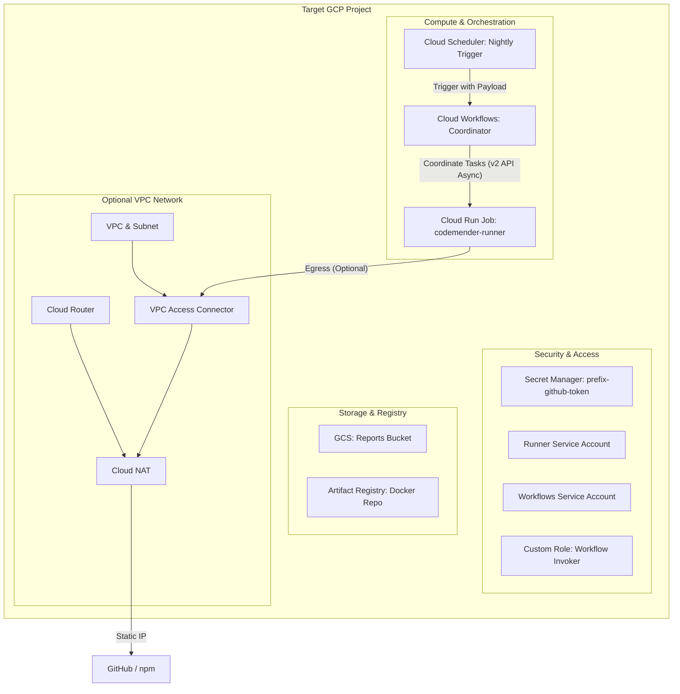

# Implementation Plan: CodeMender GCP Deployment Automation

This document serves as the absolute source of truth and guardrails for
implementing the automated GCP deployment of the CodeMender Orchestrator using
Terraform.

--------------------------------------------------------------------------------

## 1. The Problem

The CodeMender Orchestrator is a tool designed to automate security scanning and
remediation. However, deploying its parallel execution pipeline on Google Cloud
Platform (GCP) requires manual setup of multiple cloud resources, including GCS
buckets, Secret Manager, Service Accounts with complex IAM bindings, Cloud Run
Jobs, Cloud Workflows, and Cloud Scheduler.

This manual process is:

1.  **Error-Prone**: High risk of missing critical IAM permissions (e.g., URL
    signing capabilities or Secret Accessor roles).
2.  **Slow**: Onboarding a new customer or team takes significant manual effort.
3.  **Insecure**: Default configurations might lead to overly broad permissions
    (e.g., using `roles/run.developer` instead of least privilege).

We need an automated, repeatable, and secure **Infrastructure as Code (IaC)**
module using Terraform that allows teams to deploy the entire parallel scanning
pipeline into an existing GCP project with a single command.

--------------------------------------------------------------------------------

## 2. The Technical Plan

We will implement a reusable Terraform module that provisions the following
architecture:



### Key Technical Concepts:

*   **Infrastructure Lifecycle Isolation**: The module targets an *existing* GCP
    project. It manages the creation of all required resources. APIs will be
    enabled explicitly with dependencies managed in Terraform.
*   **Bootstrap Container Pattern**: To avoid failures on the first run (since
    the Docker registry will be empty), Terraform will deploy the Cloud Run Job
    pointing to a public minimal image (e.g., `alpine:latest`). We use
    `lifecycle { ignore_changes = [image] }` so subsequent Cloud Build pushes do
    not conflict with Terraform, while still allowing updates to environment
    variables and resource limits.
*   **Least-Privilege Security**: Service accounts are granted bucket-level
    access only. The Workflows engine uses a custom role to trigger and monitor
    the job, bound specifically to the runner job resource rather than
    project-wide.
*   **Optional Private Egress (VPC/NAT)**: A boolean flag (`create_vpc_and_nat`)
    enables routing all Cloud Run traffic (`egress = "ALL_TRAFFIC"`) through a
    Serverless VPC Access Connector and Cloud NAT. The VPC connector CIDR is
    parameterized to prevent overlap.
*   **Inactive-by-Default Scheduler**: The Cloud Scheduler resource is
    provisioned in a `paused = true` state.
*   **Workflow Integration**: The coordinator workflow integrates with Cloud Run
    v2 Jobs. To prevent timeout and authentication token expiration issues
    during long runs (exceeding 1 hour), the Workflow triggers the job
    asynchronously using the connector's `skip_polling: true` parameter, and
    manages wait states via a manual polling loop that queries the v2 Operation
    status.
*   **Static Workflow Definition**: The Workflow definition remains static and
    is loaded using Terraform's `file()` function. All dynamic resource
    references (Job Name, GCS Bucket Name) are passed to the Workflow at runtime
    via the trigger payload, avoiding expression syntax conflicts between
    Terraform and Workflows.

--------------------------------------------------------------------------------

## 3. Alternatives Considered and Ruled Out

*   **Creating the GCP Project via Terraform**:
    *   *Decision*: **Ruled Out**.
    *   *Rationale*: Creating a project requires Org/Folder level admin
        permissions, limiting usability.
*   **Managing the Cloud Build Trigger in Terraform**:
    *   *Decision*: **Ruled Out**.
    *   *Rationale*: Programmatic connection to GitHub via Cloud Build requires
        pre-existing manual OAuth configurations.
*   **Enforcing VPC/NAT by Default**:
    *   *Decision*: **Ruled Out**.
    *   *Rationale*: Serverless VPC Access Connectors carry a minimum monthly
        cost. Defaulting to `false` allows trial users to test CodeMender
        without incurring network infra costs.
*   **Using `roles/run.developer` for Workflows**:
    *   *Decision*: **Ruled Out**.
    *   *Rationale*: Too broad. We use a Custom IAM Role with only
        execution-related permissions (`run.jobs.run`, `run.executions.get`,
        etc.) bound at the resource level.

--------------------------------------------------------------------------------

## 4. Detailed Implementation

We will create a new directory `terraform/gcp/` containing the following files:

### 1. `terraform/gcp/provider.tf`

*   Configures the Terraform Google Provider and sets the minimum provider
    version.

### 2. `terraform/gcp/apis.tf`

*   Enables required GCP APIs explicitly:
    *   `run.googleapis.com`
    *   `workflows.googleapis.com`
    *   `secretmanager.googleapis.com`
    *   `cloudscheduler.googleapis.com`
    *   `artifactregistry.googleapis.com`
    *   `vpcaccess.googleapis.com` (conditional)
    *   `compute.googleapis.com` (conditional)

### 3. `terraform/gcp/variables.tf`

*   Declares all input variables: `project_id`, `region`, `resource_prefix`
    (defaults to `"codemender"` for environment isolation),
    `reports_bucket_name`, `runner_cpu` (defaults to `"2"`), `runner_memory`
    (defaults to `"4Gi"`), `create_vpc_and_nat`, `existing_vpc_connector_id`,
    `scheduler_cron`.
*   Includes `vpc_connector_cidr` variable, defaulting to `10.0.0.0/26` with
    regex validation, as well as `vpc_connector_min_instances`,
    `vpc_connector_max_instances`, and `vpc_connector_machine_type`.

### 4. `terraform/gcp/vpc.tf`

*   Manages conditional network infrastructure using `${var.resource_prefix}`
    for resource names (`${var.resource_prefix}-vpc`,
    `${var.resource_prefix}-subnet`, `${var.resource_prefix}-vpc-conn`, etc.).
*   Creates a `google_compute_network` and `google_compute_subnetwork` using
    `var.vpc_connector_cidr` if `create_vpc_and_nat` is true.
*   Creates `google_vpc_access_connector` linking to the subnet.
*   Creates `google_compute_router` and `google_compute_router_nat` with a
    statically allocated external IP.
*   Exposes local variables `use_vpc_access` and `vpc_connector_id` to merge
    new/existing connector configurations (e.g., using the new connector if
    created, or falling back to `existing_vpc_connector_id`).

### 5. `terraform/gcp/storage.tf`

*   Creates GCS Reports bucket (with 30-day lifecycle expiration rule).
*   Creates Artifact Registry Docker repository
    (`${var.resource_prefix}-runner`) with a cleanup policy to remove
    old/untagged images.
*   Retrieves Cloud Build Service Account using
    `data.google_project.project.number` and binds `roles/storage.objectViewer`
    across both legacy
    (`${data.google_project.project.number}@cloudbuild.gserviceaccount.com`) and
    compute default
    (`${data.google_project.project.number}-compute@developer.gserviceaccount.com`)
    service accounts for source tarball (`_cloudbuild`) access.

### 6. `terraform/gcp/secret.tf`

*   Creates `google_secret_manager_secret` for the GitHub App Token.
*   Creates a dummy version using `google_secret_manager_secret_version`
    containing `"PLACEHOLDER"`. Outputs instructions to manually update this
    secret.

### 7. `terraform/gcp/iam.tf`

*   Creates SAs for runner (`${var.resource_prefix}-runner-sa`), workflow
    (`${var.resource_prefix}-workflows-sa`), and scheduler
    (`${var.resource_prefix}-scheduler-sa`).
*   Creates custom `google_project_iam_custom_role` with permissions:
    *   `run.jobs.run`
    *   `run.jobs.runWithOverrides`
    *   `run.jobs.get`
    *   `run.operations.get` (Required for the manual polling loop using v2
        operations API)
    *   `run.executions.get`
    *   `run.executions.list`
*   Binds bucket-level roles:
    *   Runner SA: `roles/storage.objectAdmin` on Reports bucket.
    *   Workflow SA: `roles/storage.objectViewer` on Reports bucket (required
        for Stage 1 `read_manifest` step).
*   Grants `roles/iam.serviceAccountTokenCreator` on the Runner SA to itself
    (required for `signBlob` / GCS signed URL generation).
*   Binds `roles/secretmanager.secretAccessor` on the GitHub token secret to the
    Runner SA.
*   Grants the custom job runner role to the workflow SA **at the project
    level** (required to poll top-level regional Operations
    `projects/.../locations/.../operations/*`).
*   Grants `roles/iam.serviceAccountUser` on the runner SA to the workflow SA.
*   Grants `roles/workflows.invoker` to the scheduler SA at project level.

### 8. `terraform/gcp/compute.tf`

*   Creates `google_cloud_run_v2_job` (`${var.resource_prefix}-runner`)
    configured directly with the Artifact Registry image path
    (`${var.region}-docker.pkg.dev/${var.project_id}/${google_artifact_registry_repository.docker_repo.repository_id}/orchestrator:latest`).
*   Binds Secret Manager secret `${var.resource_prefix}-github-token` version
    `"latest"` to environment variable `GITHUB_APP_TOKEN`.
*   Includes dynamic `vpc_access` block to attach the connector if enabled,
    setting `egress = "ALL_TRAFFIC"`.
*   Creates `google_workflows_workflow` (`${var.resource_prefix}-coordinator`)
    loading `workflows/gcp_parallel_workflow.yaml` as static content using the
    `file()` function.

### 9. `terraform/gcp/scheduler.tf`

*   Creates `google_cloud_scheduler_job` (`${var.resource_prefix}-nightly-scan`)
    targeted at the workflow execution API.
*   Configured with a JSON payload (`argument` field) that dynamically passes
    the Terraform-provisioned resource names (Cloud Run Job name, GCS Bucket
    name) and Git scan repository details (`repo_url`, `build_command`, and
    `scan_target` configured in variables).
*   Set to `paused = true` by default.
*   Uses a dedicated Scheduler Service Account with `roles/workflows.invoker`
    permission on the workflow.

### 10. `terraform/gcp/outputs.tf`

*   Exports details: static NAT IP (if created), GCS Reports bucket URL and
    name, Artifact Registry path, Workflow trigger URL, and instructions for
    updating the GitHub App Token secret.

--------------------------------------------------------------------------------

## Appendix: Workflow Integration Interface

Reference for how the Workflow definition integrates with the Cloud Run v2 API
asynchronously and handles status polling:

```yaml
# Trigger Step (Returns immediately with Operation metadata)
- run_stage1_scan:
    call: googleapis.run.v2.projects.locations.jobs.run
    args:
      name: ${"projects/" + project_id + "/locations/" + region + "/jobs/" + job_name}
      body:
        overrides:
          taskCount: 1
          timeout: ${string(timeout_seconds) + "s"}
          containerOverrides:
            - env:
                - name: CODEMENDER_RUN_MODE
                  value: "scan"
                  # ... other env vars
      connector_params:
        skip_polling: true
    result: stage1_operation

# Polling Step (Manual loop)
- wait_stage1:
    call: wait_for_operation
    args:
      operation_name: ${stage1_operation.name}
      timeout_seconds: ${timeout_seconds}
    result: stage1_execution

# Helper Subworkflow for Manual Polling
wait_for_operation:
  params: [operation_name, timeout_seconds]
  steps:
    - init_loop:
        assign:
          - elapsed: 0
          - sleep_interval: 60
    - get_operation:
        call: googleapis.run.v2.projects.locations.operations.get
        args:
          name: ${operation_name}
        result: operation
    - check_status:
        switch:
          - condition: ${default(map.get(operation, "done"), false) == true}
            next: check_operation_result
          - condition: ${elapsed >= timeout_seconds}
            raise: '${"Operation " + operation_name + " timed out after " + string(timeout_seconds) + " seconds."}'
        next: wait_more
    - wait_more:
        call: sys.sleep
        args:
          seconds: ${sleep_interval}
    - increment_timer:
        assign:
          - elapsed: ${elapsed + sleep_interval}
        next: get_operation

    - check_operation_result:
        switch:
          - condition: ${map.get(operation, "error") != null}
            raise: '${"Operation failed: " + operation.error.message}'
          - condition: ${int(default(map.get(operation.response, "failedCount"), 0)) > 0}
            raise: '${"Job execution failed with " + string(operation.response.failedCount) + " failed tasks."}'
    - return_result:
        return: ${operation.response}
```
