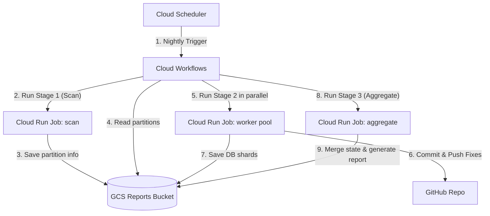
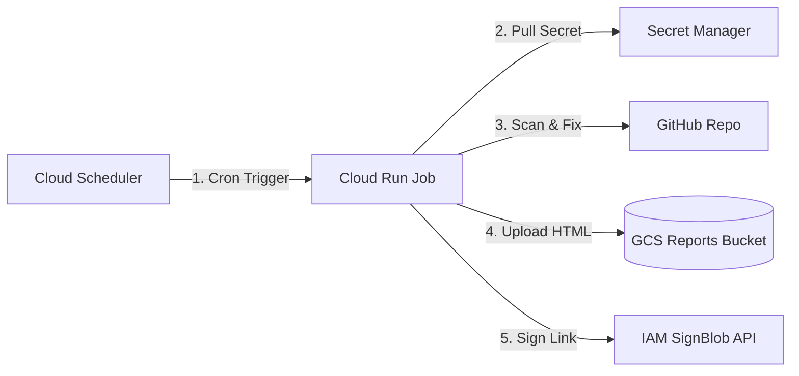

# CodeMender Orchestrator: Production Deployment Guide

This guide details the step-by-step instructions to configure, deploy, and
automate the CodeMender Orchestrator runner in production.

The orchestrator supports two deployment models:

1.  **Parallel Workflow (Recommended)**: Runs scanning, parallel worker fixing,
    and aggregation across multiple ephemeral Cloud Run containers managed by
    GCP Cloud Workflows. Recommended for standard production repositories to
    prevent timeouts.
2.  **Sequential Job (Alternative)**: Runs all stages sequentially inside a
    single Cloud Run Job container. Suitable for small repositories, trial runs,
    or simple monorepo folders.

--------------------------------------------------------------------------------

## Architecture Overview

### Deployment Path A: Parallel Workflow (Recommended)

This architecture scales dynamically, running verification and fixes in parallel
to reduce execution time and avoid container timeouts:



### Deployment Path B: Sequential Job (Alternative)

A simpler architecture that runs all operations sequentially inside one
container task:



--------------------------------------------------------------------------------

## Prerequisites & Shared Infrastructure Setup

The following setup steps are shared by **both** deployment paths. They
configure the GCP APIs, GCS buckets, Secret Manager secrets, IAM permissions,
and the base container image.

### Step 0: Enable Required Google Cloud APIs

Execute the following command to enable the APIs required for Cloud Run, Secret
Manager, Cloud Workflows, and Signed URL generation:

```bash
gcloud services enable \
    run.googleapis.com \
    secretmanager.googleapis.com \
    iamcredentials.googleapis.com \
    artifactregistry.googleapis.com \
    cloudbuild.googleapis.com \
    workflows.googleapis.com
```

### Step 1: Clone the Orchestrator Code Repository

Clone or copy the orchestrator source files to your deployment shell environment
(e.g. your local workstation or Google Cloud Shell):

```bash
git clone https://github.com/your-username/codemender-agent.git
cd codemender-agent
```

### Step 2: CLI Binary Sourcing (Automated via Artifact Registry)

In CodeMender Public Preview, the official stable CLI binary is distributed via
Google Artifact Registry (`cmoc-prod/codemender-cli-production`). Cloud Build
automatically fetches and extracts the stable `cm` binary during the container
build step (`cloudbuild.yaml`). No manual binary download or storage bucket upload is required.

### Step 3: Create a GCS Bucket for Summary Reports

Create a private GCS bucket where the orchestrator will store state shards and
upload the interactive HTML summary reports:

```bash
export PROJECT_ID=$(gcloud config get-value project)
export BUCKET_NAME="codemender-reports-${PROJECT_ID}"

# Create GCS Bucket
gcloud storage buckets create gs://${BUCKET_NAME} \
    --location=us-central1 \
    --uniform-bucket-level-access
```

### Step 4: Configure Secrets in Secret Manager

Store your GitHub Access Token securely in Secret Manager so the runner can
fetch it dynamically at runtime:

```bash
# Create the secret
gcloud secrets create GITHUB_APP_TOKEN --replication-policy="automatic"

# Add your GitHub PAT/Token value
echo -n "ghp_your_github_access_token_here" | \
    gcloud secrets versions add GITHUB_APP_TOKEN --data-file=-
```

### Step 5: Create a Dedicated Runner Service Account (IAM)

To follow the principle of least privilege, create a dedicated service account
for the scanner runner tasks:

```bash
export SA_NAME="codemender-runner-sa"
export SA_EMAIL="${SA_NAME}@${PROJECT_ID}.iam.gserviceaccount.com"

# Create Service Account
gcloud iam service-accounts create ${SA_NAME} \
    --display-name="CodeMender Orchestrator Runner Service Account"
```

#### Grant Required IAM Roles:

1.  **Secret Manager Access**: Allow the runner to read the GitHub token.

    ```bash
    gcloud secrets add-iam-policy-binding GITHUB_APP_TOKEN \
        --member="serviceAccount:${SA_EMAIL}" \
        --role="roles/secretmanager.secretAccessor"
    ```

2.  **GCS Read/Write Access**: Allow the runner to upload reports and sign URL
    requests.

    ```bash
    gcloud storage buckets add-iam-policy-binding gs://${BUCKET_NAME} \
        --member="serviceAccount:${SA_EMAIL}" \
        --role="roles/storage.objectUser"
    ```

3.  **Signed URL SignBlob permission**: Allows the service account to sign
    payloads on its own behalf to generate v4 Signed URLs without service
    account key files.

    ```bash
    gcloud iam service-accounts add-iam-policy-binding ${SA_EMAIL} \
        --member="serviceAccount:${SA_EMAIL}" \
        --role="roles/iam.serviceAccountTokenCreator"
    ```

4.  **Logs Writer Access**: Allow the runner to write execution logs to Cloud
    Logging.

    ```bash
    gcloud projects add-iam-policy-binding ${PROJECT_ID} \
        --member="serviceAccount:${SA_EMAIL}" \
        --role="roles/logging.logWriter"
    ```

5.  **Service Account User (ActAs) Access**: Allow the deploying user to run
    resources as this Service Account.

    ```bash
    export USER_EMAIL=$(gcloud config get-value account)
    gcloud iam service-accounts add-iam-policy-binding ${SA_EMAIL} \
        --member="user:${USER_EMAIL}" \
        --role="roles/iam.serviceAccountUser"
    ```

### Step 6: Build and Push the Docker Container

Compile and push the container image to Artifact Registry using Cloud Build
(which fetches the stable `cm` CLI binary directly from Google Artifact Registry
and packages it alongside your environment):

1.  Create a Google Artifact Registry Docker repository (if one does not exist):

    ```bash
    gcloud artifacts repositories create codemender-runner \
        --repository-format=docker \
        --location=us-central1
    ```

2.  Compile and push the container image:

    ```bash
    gcloud builds submit --config=cloudbuild.yaml .
    ```

--------------------------------------------------------------------------------

## Deployment Path A: Parallel Workflow (Recommended for Production)

Use this path to deploy a 3-stage parallel pipeline managed by **Google Cloud
Workflows**. This setup prevents timeouts for larger repositories by executing
fixes in parallel.

### Step A.1: Deploy the Reusable Cloud Run Job

Deploy a single Cloud Run Job that acts as the container pool. The Workflow will
override the environment variables (like `CODEMENDER_RUN_MODE`) dynamically at
execution time.

```bash
gcloud run jobs create codemender-runner \
    --image=us-central1-docker.pkg.dev/${PROJECT_ID}/codemender-runner/orchestrator:latest \
    --region=us-central1 \
    --service-account=${SA_EMAIL} \
    --execution-environment=gen2 \
    --task-timeout=1h \
    --memory=4Gi \
    --cpu=2 \
    --set-secrets="GITHUB_APP_TOKEN=GITHUB_APP_TOKEN:latest"
```

### Step A.2: Configure IAM Roles for Workflows

Create a service account for Cloud Workflows (e.g. `codemender-workflows-sa`)
and grant it permissions to execute Cloud Run Jobs and read status files from
GCS:

```bash
export WORKFLOWS_SA_NAME="codemender-workflows-sa"
export WORKFLOWS_SA_EMAIL="${WORKFLOWS_SA_NAME}@${PROJECT_ID}.iam.gserviceaccount.com"

# Create Service Account
gcloud iam service-accounts create ${WORKFLOWS_SA_NAME} \
    --display-name="CodeMender Workflows Service Account"

# Grant permission to trigger Cloud Run Jobs with overrides
gcloud projects add-iam-policy-binding ${PROJECT_ID} \
    --member="serviceAccount:${WORKFLOWS_SA_EMAIL}" \
    --role="roles/run.developer"

# Grant permission to act as the runner service account
gcloud iam service-accounts add-iam-policy-binding ${SA_EMAIL} \
    --member="serviceAccount:${WORKFLOWS_SA_EMAIL}" \
    --role="roles/iam.serviceAccountUser"

# Grant GCS read access to retrieve partitions
gcloud storage buckets add-iam-policy-binding gs://${BUCKET_NAME} \
    --member="serviceAccount:${WORKFLOWS_SA_EMAIL}" \
    --role="roles/storage.objectViewer"

# Grant Logs Writer access
gcloud projects add-iam-policy-binding ${PROJECT_ID} \
    --member="serviceAccount:${WORKFLOWS_SA_EMAIL}" \
    --role="roles/logging.logWriter"
```

### Step A.3: Deploy the Workflow

Deploy the `gcp_parallel_workflow.yaml` orchestration configuration:

```bash
gcloud workflows deploy codemender-parallel-workflow \
    --source=workflows/gcp_parallel_workflow.yaml \
    --location=us-central1 \
    --service-account=${WORKFLOWS_SA_EMAIL} \
    --call-log-level=log-errors-only
```

### Step A.4: Execute the Workflow Manually

Trigger the parallel workflow with your repository and build details:

```bash
gcloud workflows run codemender-parallel-workflow \
    --location=us-central1 \
    --data='{
      "job_name": "codemender-runner",
      "gcs_bucket": "'"${BUCKET_NAME}"'",
      "repo_url": "https://github.com/your-org/your-repo.git",
      "build_command": "npm install && npm test"
    }'
```

### Step A.5: Automate Nightly Parallel Scans

Create a scheduled Cloud Scheduler trigger to automate the workflow nightly:

```bash
gcloud scheduler jobs create http codemender-parallel-nightly \
    --location=us-central1 \
    --schedule="0 2 * * *" \
    --uri="https://workflowexecutions.googleapis.com/v1/projects/${PROJECT_ID}/locations/us-central1/workflows/codemender-parallel-workflow/executions" \
    --http-method=POST \
    --message-body='{
      "argument": "{\"job_name\":\"codemender-runner\",\"gcs_bucket\":\"'"${BUCKET_NAME}"'\",\"repo_url\":\"https://github.com/your-org/your-repo.git\",\"build_command\":\"npm install && npm test\"}"
    }' \
    --oauth-service-account-email="${WORKFLOWS_SA_EMAIL}"
```

--------------------------------------------------------------------------------

## Deployment Path B: Sequential Job (Alternative for Smaller Repositories)

Use this path if you prefer a simpler architecture that runs all operations
(Scan $\rightarrow$ Fix [$\rightarrow$ Verify optional] $\rightarrow$ PR / Suggestion) sequentially
inside a single container task.

### Step B.1: Deploy the Cloud Run Job

Deploy the job, setting default repository environment variables directly:

```bash
gcloud run jobs create codemender-scan \
    --image=us-central1-docker.pkg.dev/${PROJECT_ID}/codemender-runner/orchestrator:latest \
    --region=us-central1 \
    --service-account=${SA_EMAIL} \
    --execution-environment=gen2 \
    --task-timeout=1h \
    --memory=4Gi \
    --cpu=2 \
    --set-env-vars="GITHUB_REPO_URL=https://github.com/your-org/your-repo.git,CODEMENDER_BUILD_COMMAND='npm install && npm test',CODEMENDER_REPORT_BUCKET=${BUCKET_NAME}" \
    --set-secrets="GITHUB_APP_TOKEN=GITHUB_APP_TOKEN:latest"
```

### Step B.2: Test Execute the Job Manually

Trigger the sequential job manually to verify it clones, scans, fixes, and
pushes successfully:

```bash
gcloud run jobs execute codemender-scan --region=us-central1
```

*Note: You can pass temporary overrides to a single run using the
`--update-env-vars` flag, such as running a forced overwrite scan:*

```bash
gcloud run jobs execute codemender-scan \
    --region=us-central1 \
    --update-env-vars="CODEMENDER_FORCE_OVERWRITE=true"
```

### Step B.3: Automate Nightly Sequential Scans

Create a scheduled Cloud Scheduler trigger to run the sequential job nightly:

```bash
gcloud scheduler jobs create http codemender-nightly-trigger \
    --location=us-central1 \
    --schedule="0 2 * * *" \
    --uri="https://us-central1-run.googleapis.com/v2/projects/${PROJECT_ID}/locations/us-central1/jobs/codemender-scan:run" \
    --http-method=POST \
    --oauth-service-account-email="${SA_EMAIL}"
```

--------------------------------------------------------------------------------

## Features & Advanced Configurations

### Scanning Monorepos or Large Codebases (Target Scans)

If your repository contains multiple sub-projects, microservices, or complex
build artifacts, scanning the entire root directory may trigger client transfer
payload limits.

To solve this:

1.  **Restrict the Scan Target**: Pass the `CODEMENDER_SCAN_TARGET` variable
    containing targeted paths separated by semicolons (e.g.
    `api;server/shared`). Semicolons are recommended for Cloud Run parameters to
    avoid CLI flag comma-splitting conflicts.
2.  **Configure Sandbox Boundaries**: Create a `.codemender.yaml` configuration
    file at the root of your source repository containing:

    ```yaml
    project_paths:
      - "."
    ```

    This allows the CodeMender agent to explore and read imported files in
    sibling directories during targeted validations.

### CodeMender Public Preview CLI & Model Overrides

The orchestrator defaults to `CODEMENDER_CLI_VERSION="preview"`, enabling Public Preview CLI syntax (`cm find -y`, `cm verify -y --bypass-warning`, `cm fix -y --bypass-warning`).

You can override LLM models per stage when executing jobs or triggering Workflows:
*   **Global Model Override**: `--update-env-vars="CODEMENDER_MODEL=gemini-2.5-flash"`
*   **Stage-Specific Overrides**: `--update-env-vars="CODEMENDER_FIND_MODEL=gemini-2.5-pro,CODEMENDER_FIX_MODEL=gemini-2.5-flash"`
*   **Skip Exploit Verification**: `--update-env-vars="CODEMENDER_SKIP_EXPLOIT_VERIFICATION=true"` (bypasses compilation/execution of exploits during verification phase).
*   **Skip Verification Phase**: `--update-env-vars="CODEMENDER_SKIP_VERIFY=false"` (enforces running `cm verify` before `cm fix`; default is `true` which skips verification).
*   **PR Remediation Mode**: `--update-env-vars="CODEMENDER_PR_REMEDIATION_MODE=child_pr"` (delivers PR fixes via Child PR instead of default one-click inline review suggestions).

### Scaling Storage Beyond 10GB

Cloud Run Gen 2 jobs provision `10GB` of ephemeral root disk space by default.
If your repository has a massive dependency tree:

```bash
gcloud run jobs create codemender-scan \
    ... \
    --add-volume=name=scratch,type=ephemeral-disk,size=20Gi \
    --add-volume-mount=volume=scratch,mount-path=/workspace \
    --set-env-vars="WORKSPACE_DIR=/workspace,GITHUB_REPO_URL=..."
```

--------------------------------------------------------------------------------

## Monitoring & Summary Reports

*   **View Logs**: Monitor execution traces directly in Cloud Logging or the
    Cloud Run console.
*   **Access Summary Reports**: At the end of the logs, look for the summary
    banner containing the Signed URL:

    ```
    ======================================================================
    📊 CODEMENDER SUMMARY REPORT GENERATED:
    👉 https://storage.googleapis.com/codemender-reports-...&Signature=...
    ======================================================================
    ```

    *Note: The signed URL is valid for 3 days. Older reports can always be
    accessed directly from the GCS Reports Bucket.*

--------------------------------------------------------------------------------

## Adding and Scanning a New Repository

Because the orchestrator is generic, you **do not** need to re-create the base
infrastructure (GCS buckets, Service Accounts, Secret Manager) for every
repository.

### Path A: Parallel Workflow (Recommended)

If using the parallel workflow, the setup is dynamically parameterized. You **do
not** need to deploy any new Cloud Run Jobs or Workflows.

1.  **Execute the workflow dynamically**:

    ```bash
    gcloud workflows run codemender-parallel-workflow \
        --location=us-central1 \
        --data='{
          "job_name": "codemender-runner",
          "gcs_bucket": "codemender-reports-[PROJECT-ID]",
          "repo_url": "https://github.com/your-org/new-repo.git",
          "build_command": "npm install && npm test"
        }'
    ```

2.  **Create a nightly Scheduler job (Step A.5)** with a unique trigger name and
    the serialized JSON payload for the new repository.

### Path B: Sequential Job

If using the sequential job path, you must deploy a separate job for each
repository:

1.  **Deploy a new Job (Step B.1)** with a unique name (e.g.
    `codemender-scan-[NEW-REPO]`) and configure its target environment
    variables.
2.  **Test run the new job (Step B.2)**.
3.  **Schedule the new job (Step B.3)** using a unique trigger name.

--------------------------------------------------------------------------------

## Future Work

### GitHub Actions Orchestration (Non-GCP Runner Hosts)

Orchestrating parallel execution inside GitHub Actions using self-hosted or
GitHub-hosted runners is planned as future work.

In this model, the GHA runner acts as the control plane (replacing GCP
Workflows), spawning matrix jobs that use GCS Signed URLs from `manifest.json`
to download resources, run fixes, and upload sharded DBs. This allows using
CodeMender credential-free on worker nodes.

The draft workflow configuration was previously created as
`workflows/gha_parallel_workflow.yaml`. Support for this will be stabilized in a
future release.
