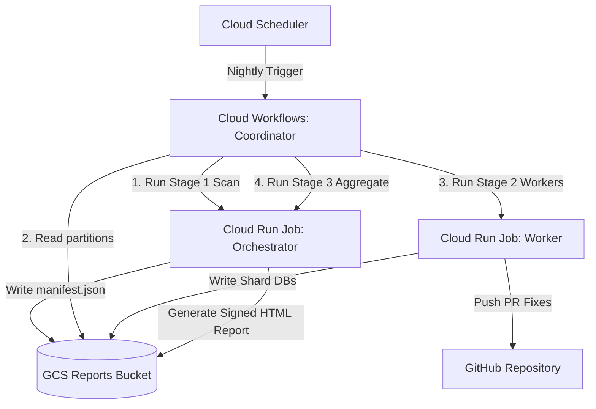

# CodeMender Orchestrator: Automated Terraform Deployment & Parallel Execution Guide

This guide provides step-by-step instructions to setup, deploy, and run the
**CodeMender Orchestrator Parallel Scanning Pipeline** on Google Cloud Platform
(GCP) using Terraform.

--------------------------------------------------------------------------------

## 1. Architecture Overview

The parallel scanning pipeline uses **Infrastructure as Code (IaC)** to
provision:

*   **Google Cloud Storage (GCS)**: Private bucket for scan reports (`reports`).
*   **Artifact Registry**: Docker container repository for runner images
    (`codemender-runner`).
*   **Secret Manager**: Secure storage for GitHub tokens
    (`${PREFIX}-github-token`).
*   **Service Accounts & Custom IAM**: Ephemeral, least-privilege access for
    Cloud Run, Cloud Workflows, and Cloud Build.
*   **Cloud Run v2 Jobs**: Ephemeral orchestrator container pool (`runner`) for `scan` and `aggregate` modes, and a dedicated unprivileged `worker` container pool for executing untrusted tests.
*   **Cloud Workflows**: Coordinator workflow orchestrating multi-stage parallel
    tasks without container timeouts.
*   **Cloud Scheduler**: Nightly trigger for automated repository scanning.
*   *(Optional)* **Serverless VPC Access & Cloud NAT**: Dedicated private
    network egress routing.

### Resource Scope: Shared vs. Isolated (Multi-Prefix Deployments)

If you deploy multiple pipelines in the same GCP project using different
`resource_prefix` values, resources are partitioned as follows:

*   **Shared Resources (Project-wide)**:
    *   **GCP APIs**: APIs enabled for the project are shared by all pipelines.
*   **Isolated Resources (Unique per prefix)**:
    *   **Compute & Workflow**: Cloud Run Jobs (`${prefix}-runner`, `${prefix}-worker`) and Cloud
        Workflow (`${prefix}-coordinator`).
    *   **Storage & Secret**: GCS Reports bucket, Artifact Registry
        repository, and Secret Manager GitHub secret (`${prefix}-github-token`).
    *   **Security**: Service Accounts (`${prefix}-runner-sa`, `${prefix}-worker-sa`, etc.) and Custom
        IAM Role bindings (suffixed with `random_id` to prevent 7-day GCP IAM soft-delete tombstone conflicts).
    *   **VPC & Networking**: Dedicated VPC Connector (`${prefix}-vpc-conn`) and
        Router (requires setting distinct `vpc_connector_cidr` ranges).



--------------------------------------------------------------------------------

## 2. Prerequisites

Ensure you have the following before starting:

1.  **GCP Project**: An active GCP project with billing enabled.
2.  **Local Tooling**: Installed `gcloud` CLI, `terraform` (v1.3.0+), `git`, and
    `docker`.
3.  **IAM Permissions**: User account with `Owner` or `Editor` + `Security
    Admin` privileges on the target GCP project.
4.  **GitHub Authentication Token**: A valid GitHub token stored in GCP Secret
    Manager (prefixed as `${PREFIX}-github-token`). CodeMender natively supports
    either token type:

    *   **Option A: Personal Access Token (PAT)**

        *   **Official Documentation**:
            [GitHub Docs: Managing your personal access tokens](https://docs.github.com/en/authentication/keeping-your-account-and-data-secure/managing-your-personal-access-tokens)
        *   **Required Scopes**: `repo` (for classic PATs) OR `Contents: Read
            and write` + `Pull requests: Read and write` (for Fine-grained
            PATs).
        *   **Prefix Format**: Starts with `ghp_...` (classic) or
            `github_pat_...` (fine-grained).
        *   **Lifetime**: Long-lived / static until manually revoked or expired.

    *   **Option B: GitHub App Installation Token**

        *   **Official Documentation**:
            *   [GitHub Docs: About creating GitHub Apps](https://docs.github.com/en/apps/creating-github-apps/about-creating-github-apps/about-creating-github-apps)
            *   [GitHub Docs: Authenticating as a GitHub App Installation](https://docs.github.com/en/apps/creating-github-apps/authenticating-with-a-github-app/authenticating-as-a-github-app-installation)
        *   **Required Permissions**: `Contents: Read & Write`, `Pull Requests:
            Read & Write`, `Metadata: Read-Only`.
        *   **Prefix Format**: Starts with `ghs_...`.
        *   **Lifetime**: Ephemeral (valid for **1 hour**).

--------------------------------------------------------------------------------

## 3. Step-by-Step Setup & Deployment

### Step 1: Provision Infrastructure with Terraform

Clone the repository and navigate to the `terraform/gcp/` directory:

```bash
git clone https://github.com/your-username/codemender-agent.git
cd codemender-agent/terraform/gcp
```

#### Where to create `terraform.tfvars`:

The `terraform.tfvars` file **must be created directly inside
`terraform/gcp/terraform.tfvars`**.

#### Setting Environment Prefix & Cloud Run Resources (`runner_cpu` / `runner_memory`):

Set your project variables, environment prefix, and desired Cloud Run Job
CPU/Memory limits:

```bash
# Set your active GCP Project ID and Environment Prefix
export PROJECT_ID=$(gcloud config get-value project)
export PREFIX="codemender-dev"  # <-- Set your environment prefix here

# Generate terraform.tfvars inside terraform/gcp/
cat <<EOF > terraform.tfvars
project_id           = "${PROJECT_ID}"
region               = "us-central1"    # Target GCP region for all resources
resource_prefix      = "${PREFIX}"      # Base prefix used to name all created resources
runner_cpu           = "2"              # Cloud Run Job vCPU limit ("1", "2", "4", "8")
runner_memory        = "4Gi"            # Cloud Run Job RAM limit ("2Gi", "4Gi", "8Gi", "16Gi")
create_vpc_and_nat   = false            # Set to true to create a private VPC and Cloud NAT for egress
scheduler_cron       = "0 2 * * *"      # Cron expression for the nightly scheduled run
EOF
```

*(Alternatively, create `terraform/gcp/terraform.tfvars` manually using `nano`
or `touch` and set `runner_cpu = "4"` / `runner_memory = "8Gi"`).*

#### Apply Terraform Configuration:

Initialize and apply the Terraform configuration to provision the GCS buckets,
Artifact Registry, Service Accounts, IAM bindings, Cloud Run Job, Workflows,
Secret Manager secret, and enable all required GCP APIs:

```bash
# Initialize provider plugins
terraform init

# Review execution plan
terraform plan

# Provision all infrastructure resources
terraform apply -auto-approve
```

--------------------------------------------------------------------------------

### Step 2: CLI Binary Sourcing (Automated via Artifact Registry)

In CodeMender Public Preview, the official stable CLI binary is distributed via
Google Artifact Registry (`cmoc-prod/codemender-cli-production`). Cloud Build
automatically fetches and extracts the stable `cm` binary during the container
build step (`cloudbuild.yaml`). No manual binary download or storage bucket upload is required.

--------------------------------------------------------------------------------

### Step 3: Build, Push & Deploy Base Docker Container Image

Return to the repository root directory (`codemender-agent/`) and build the
runner container image using Cloud Build (which fetches the stable `cm` binary,
pushes the container to Artifact Registry, and updates the Cloud Run Jobs):

```bash
cd ../..

export PROJECT_ID=$(gcloud config get-value project)
export REPO_NAME="${PREFIX}-runner"
export REGION="us-central1"

# Build and push container image to Artifact Registry, and deploy to Cloud Run
gcloud builds submit --config=cloudbuild.yaml \
    --substitutions=_REPO_NAME="${REPO_NAME}",_REGION="${REGION}" .
```

--------------------------------------------------------------------------------

### Step 4: Populate GitHub Access Token in Secret Manager

Terraform initializes the `${PREFIX}-github-token` Secret Manager secret with
placeholder data (`"PLACEHOLDER"`). Add your actual GitHub PAT or GitHub App
Installation Access Token:

#### Using a GitHub Personal Access Token (PAT):

```bash
export PROJECT_ID=$(gcloud config get-value project)

# Add PAT version (ghp_...) to Secret Manager
echo -n "ghp_your_github_personal_access_token" | \
    gcloud secrets versions add "${PREFIX}-github-token" \
    --data-file=- \
    --project=${PROJECT_ID}
```

#### Using a GitHub App Installation Token:

```bash
export PROJECT_ID=$(gcloud config get-value project)

# Add GitHub App Installation Access Token (ghs_...) to Secret Manager
echo -n "ghs_your_github_app_installation_token" | \
    gcloud secrets versions add "${PREFIX}-github-token" \
    --data-file=- \
    --project=${PROJECT_ID}
```

> [!NOTE]
> **Token Expiration Handling**: Because GitHub App Installation Tokens
> (`ghs_...`) expire after 1 hour, automated nightly pipelines using GitHub Apps
> should generate fresh tokens prior to execution using the GitHub App Private
> Key (`.pem`) and App ID, then update Secret Manager via `gcloud secrets
> versions add`.

--------------------------------------------------------------------------------

### Step 5: Execute Parallel Scan Workflow (Supports Multiple Repositories)

The provisioned Cloud Workflows coordinator is **fully reusable** and stateless.
You can use this single deployment to scan **different repositories** on-demand
by simply passing the target repository's URL and build command in the execution
data payload.

#### Example A: Scan Repository 1 (NodeJS App)

```bash
export REGION="us-central1"
export PROJECT_ID=$(gcloud config get-value project)
export REPORTS_BUCKET="${PREFIX}-reports-${PROJECT_ID}"
export JOB_NAME="${PREFIX}-runner"
export WORKER_JOB_NAME="${PREFIX}-worker"
export WORKFLOW_NAME="${PREFIX}-coordinator"

gcloud workflows run ${WORKFLOW_NAME} \
    --location=${REGION} \
    --data='{
      "cli_version": "preview",
      "job_name": "'"${JOB_NAME}"'",
      "worker_job_name": "'"${WORKER_JOB_NAME}"'",
      "gcs_bucket": "'"${REPORTS_BUCKET}"'",
      "repo_url": "https://github.com/your-org/your-repo.git",
      "build_command": "npm install && npm test",
      "scan_target": ".",
      "max_tasks": 20,
      "models": {
        "find": "gemini-3.1-pro-preview",
        "verify": "gemini-3-flash-preview",
        "fix": "gemini-3-flash-preview"
      }
    }'
```

#### Example B: Scan Repository 2 (Python App)

To scan a completely different repository, run the command again with updated
details:

```bash
gcloud workflows run ${WORKFLOW_NAME} \
    --location=${REGION} \
    --data='{
      "job_name": "'"${JOB_NAME}"'",
      "worker_job_name": "'"${WORKER_JOB_NAME}"'",
      "gcs_bucket": "'"${REPORTS_BUCKET}"'",
      "repo_url": "https://github.com/your-org/flask-api.git",
      "build_command": "pip install -r requirements.txt && pytest",
      "scan_target": "src/",
      "max_tasks": 10
    }'
```

#### Supported Workflow Arguments (`--data`)

When triggering the workflow, you pass a JSON object to the `--data` flag. The
coordinator unpacks these values and injects them as environment variables into
the Cloud Run jobs:

| JSON Field | Required | Maps to Environment Variable | Description |
| :--- | :--- | :--- | :--- |
| `job_name` | Yes | N/A (Cloud Run resource name) | The name of the provisioned Cloud Run job for the orchestrator (`scan` and `aggregate`). |
| `worker_job_name` | No | N/A (Cloud Run resource name) | The name of the provisioned Cloud Run job for the `worker` stage. Defaults to `${job_name}` with `"-runner"` replaced by `"-worker"`. |
| `gcs_bucket` | Yes | `CODEMENDER_GCS_BUCKET` | The GCS bucket to use for state and the final report. |
| `repo_url` | Yes | `GITHUB_REPO_URL` | The GitHub HTTPS URL of the repository to scan. |
| `region` | No | N/A (GCP Region) | The GCP region where the Cloud Run job resides. Defaults to `"us-central1"`. |
| `build_command` | Yes | `CODEMENDER_BUILD_COMMAND` | Your custom test command (e.g., `make test` or `.codemender.yaml`). |
| `scan_target` | No | `CODEMENDER_SCAN_TARGET` | Directory or directories to scan. Defaults to `.` (the whole repo). Examples: `"src/"` or `"src/;lib/;cmd/"`. |
| `max_tasks` | No | `CODEMENDER_MAX_TASKS` | Max parallel worker tasks (containers). Defaults to `20`. |
| `timeout_seconds` | No | N/A (Job Task Timeout) | Task timeout duration in seconds for Cloud Run job stages. Defaults to `86400`. |
| `cli_version` | No | `CODEMENDER_CLI_VERSION` | CLI version mode: `"preview"` or `"legacy"`. Defaults to `"preview"`. |
| `model` | No | `CODEMENDER_MODEL` | Default model override for all CodeMender commands (e.g. `"gemini-3.5-flash"`), check available models in [here](https://docs.cloud.google.com/gemini-enterprise-agent-platform/codemender#specifying-the-model). |
| `models` | No | `CODEMENDER_<CMD>_MODEL` | Per-command model selection map: `{"find": "...", "verify": "...", "fix": "..."}`. |
| `skip_exploit_verification` | No | `CODEMENDER_SKIP_EXPLOIT_VERIFICATION` | Set to `true` to skip exploit compilation/execution during verify phase. |
| `skip_verify` | No | `CODEMENDER_SKIP_VERIFY` | Set to `false` to run `cm verify` before `cm fix` (default is `true`, which skips verify). |
| `pr_remediation_mode` | No | `CODEMENDER_PR_REMEDIATION_MODE` | How PR fixes are delivered: `"review_suggestion"` (default, one-click inline suggestions) or `"child_pr"` (push branch & open Child PR). |
| `cleanup_ports`* | No | `CODEMENDER_CLEANUP_PORTS` | Comma-separated ports to kill before testing. |
| `force_overwrite`* | No | `CODEMENDER_FORCE_OVERWRITE` | Pass `"true"` to bypass PR spam prevention and force re-run fixes and push PRs. |

> [!NOTE]
> **\*Customizing Advanced Job Parameters (`cleanup_ports` and
> `force_overwrite`)**: Currently, the default `gcp_parallel_workflow.yaml` does
> not dynamically parse `cleanup_ports` or `force_overwrite` from the `--data`
> trigger payload. To use these settings in a parallel workflow execution, you
> can either:
>
> 1.  **Configure on the Cloud Run Job directly (Recommended without deploying

>     workflow)**: Update the default environment variables on the underlying
>     Cloud Run Job using `gcloud run jobs update ${JOB_NAME} --region=${REGION}
>     --update-env-vars="CODEMENDER_FORCE_OVERWRITE=true,CODEMENDER_CLEANUP_PORTS=3000,8080"`.
>
> 2.  **Customize the Workflow YAML**: Modify
>     `workflows/gcp_parallel_workflow.yaml` to include `cleanup_ports` and
>     `force_overwrite` in the > `init_variables` block and pass them in
>     `containerOverrides`, then redeploy the workflow (`gcloud workflows
>     deploy`).

### Step 6: Monitor Execution & Retrieve Summary Report

1.  **Monitor Workflow Execution**: View real-time state transitions and worker
    logs:

    ```bash
    gcloud workflows executions list ${WORKFLOW_NAME} --location=${REGION}
    ```

2.  **Access HTML Summary Report**: At the end of Stage 3 (Aggregate), inspect
    the signed HTML report URL printed in Cloud Logging or retrieve it directly
    from GCS:

    ```bash
    gcloud storage ls gs://${REPORTS_BUCKET}/scans/
    ```

--------------------------------------------------------------------------------

### Step 7: Enable and Manage Nightly Scheduled Runs

The provisioned Cloud Scheduler job is paused by default. To enable nightly
automated scanning:

```bash
export REGION="us-central1"
export SCHEDULER_JOB_NAME="${PREFIX}-nightly-scan"
gcloud scheduler jobs resume ${SCHEDULER_JOB_NAME} --location=${REGION}
```

#### A. How to Update the Default Scheduler Job target

To update which repository or build command the default scheduler scans, run
`gcloud scheduler jobs update http` with a revised JSON message body:

```bash
export REGION="us-central1"
export PROJECT_ID=$(gcloud config get-value project)
export SCHEDULER_JOB_NAME="${PREFIX}-nightly-scan"

# Update payload to point to a new repository
gcloud scheduler jobs update http ${SCHEDULER_JOB_NAME} \
    --location=${REGION} \
    --message-body='{"argument":"{\"job_name\":\"'"${PREFIX}"'-runner\",\"worker_job_name\":\"'"${PREFIX}"'-worker\",\"gcs_bucket\":\"'"${PREFIX}"'-reports-'"${PROJECT_ID}"'\",\"region\":\"'"${REGION}"'\",\"repo_url\":\"https://github.com/new-org/new-repo.git\",\"build_command\":\"npm install && npm test\",\"scan_target\":\".\"}"}'
```

#### B. How to Add a New Scheduled Job for a different Repository

You can schedule scans for multiple repositories by registering additional
scheduler jobs targeting the same Workflows instance.

Run `gcloud scheduler jobs create http` using the provisioned scheduler Service
Account:

```bash
export PROJECT_ID=$(gcloud config get-value project)
export REGION="us-central1"
export WORKFLOW_EXECUTION_URL="https://workflowexecutions.googleapis.com/v1/projects/${PROJECT_ID}/locations/${REGION}/workflows/${PREFIX}-coordinator/executions"
export SCHEDULER_SA="${PREFIX}-scheduler-sa@${PROJECT_ID}.iam.gserviceaccount.com"

# Create a new scheduled trigger running at 3:00 AM UTC
gcloud scheduler jobs create http ${PREFIX}-second-repo-nightly \
    --location=${REGION} \
    --schedule="0 3 * * *" \
    --time-zone="Etc/UTC" \
    --uri=${WORKFLOW_EXECUTION_URL} \
    --http-method="POST" \
    --headers="Content-Type=application/json" \
    --oauth-service-account-email=${SCHEDULER_SA} \
    --message-body='{"argument":"{\"job_name\":\"'"${PREFIX}"'-runner\",\"worker_job_name\":\"'"${PREFIX}"'-worker\",\"gcs_bucket\":\"'"${PREFIX}"'-reports-'"${PROJECT_ID}"'\",\"region\":\"'"${REGION}"'\",\"repo_url\":\"https://github.com/another-org/another-repo.git\",\"build_command\":\"python3 -m pip install . && pytest\",\"scan_target\":\".\"}"}'
```

--------------------------------------------------------------------------------

## 4. Troubleshooting & Operational Commands

*   **Update Runner Container Image**: Re-build the image with `gcloud builds
    submit`.
*   **Manual Job Overrides**: Test run a single Cloud Run Job task manually:

    ```bash
    gcloud run jobs execute ${JOB_NAME} \
        --region=${REGION} \
        --update-env-vars="CODEMENDER_RUN_MODE=scan,GITHUB_REPO_URL=https://github.com/your-org/your-repo.git"
    ```

*   **Clean Up Resources**: To tear down the infrastructure:

    ```bash
    cd terraform/gcp
    terraform destroy
    ```

--------------------------------------------------------------------------------

## 5. Appendix: Pipeline Architectures (Shared vs. Isolated)

When onboarding new repositories, you have two choices for how to organize your
CodeMender pipeline infrastructure.

### Shared Pipeline Model (Reusing the Same Workflow) - *Default & Recommended*

Under this model, you deploy **one** Cloud Workflow and **one** Cloud Run Job.
You scan different repositories on-demand by passing their Git URL and build
commands dynamically in the trigger payload (`gcloud workflows run` or unique
Scheduled nightly tasks).

*   **When to Use**:
    *   Scanning multiple repositories belonging to **the same team or
        organization**.
    *   Repositories use **similar programming languages/tech stacks** (e.g. all
        NodeJS).
    *   You want **instant onboarding** (no new GCP resources to deploy).
*   **Tradeoffs**:
    *   **Shared IAM Context**: All repository scans share the same Service
        Account and GCS bucket access. A vulnerability in one repo's test script
        could theoretically read reports of another repo.
    *   **Container Bloat**: The runner container image must be updated to
        install the language runtimes and compilers (NodeJS, Python, Go, Java,
        etc.) required for all repositories.

### Isolated Pipeline Model (Workflow & Runner Per Repo)

Under this model, you run the Terraform deployment separately for each
repository (e.g., using different `resource_prefix` values like
`codemender-app-a`, `codemender-app-b`), provisioning a dedicated workflow,
runner job, GCS reports bucket, and Service Account for each repository.

*   **When to Use**:
    *   Scanning repositories across **different business units, teams, or
        customers** where tenant isolation is mandatory.
    *   Scanning repositories with **untrusted validation scripts** where strict
        sandboxing is critical.
    *   Scanning repositories that require **specialized OS dependencies or
        massive compile jobs** (allowing you to tailor CPU/RAM limits per repo).
*   **Tradeoffs**:
    *   **Deployment Overhead**: Requires deploying and maintaining multiple
        Terraform state files, service accounts, and logging scopes.
    *   **Secret Proliferation**: Each repository requires its own Secret
        Manager instance for its individual access tokens.

--------------------------------------------------------------------------------

## 6. Deploying Multiple Environments (Advanced)

If you need to deploy multiple isolated environments side-by-side (e.g.,
`codemender-dev` and `codemender-prod`) using the same Terraform configuration,
you should **not** simply overwrite `terraform.tfvars` and re-run `terraform
apply`. Doing so will destroy your first environment and replace it with the new
one.

Instead, use **Terraform Workspaces** to manage separate state files for each
environment.

### 1. Create a New Terraform Workspace

Navigate to your `terraform/gcp` directory and create a new workspace for your
second environment:

```bash
cd codemender-agent/terraform/gcp
terraform workspace new prod  # Name it whatever you like (e.g., prod, testing)
```

### 2. Create an Environment-Specific Variable File

Create a new file specifically for this environment, for example `prod.tfvars`:

```bash
export PROJECT_ID=$(gcloud config get-value project)
export PREFIX="codemender-prod"  # <-- Your second environment prefix

cat <<VARS > prod.tfvars
project_id           = "${PROJECT_ID}"
region               = "us-central1"    # Target GCP region for all resources
resource_prefix      = "${PREFIX}"      # Base prefix used to name all created resources
runner_cpu           = "2"              # Cloud Run Job vCPU limit ("1", "2", "4", "8")
runner_memory        = "4Gi"            # Cloud Run Job RAM limit ("2Gi", "4Gi", "8Gi", "16Gi")
create_vpc_and_nat   = false            # Set to true to create a private VPC and Cloud NAT for egress
scheduler_cron       = "0 2 * * *"      # Cron expression for the nightly scheduled run
VARS
```

### 3. Deploy the Second Environment

Run `terraform apply` but tell it to use your new variable file:

```bash
terraform apply -var-file="prod.tfvars"
```

### 4. Repeat Application Setup Steps

Because this is a completely new set of infrastructure, you **must** repeat the
application setup steps (Steps 3-4) for the new prefix:

1.  **Build and Deploy (Step 3)**: Re-run the `gcloud builds submit` command so
    the container is built (fetching the stable `cm` binary from Artifact Registry),
    pushed to the new environment's Artifact Registry, and deployed to the new
    Cloud Run Jobs.
2.  **Populate Secrets (Step 4)**: Add the GitHub Token to the new
    `${PREFIX}-github-token` secret in Secret Manager.

> [!TIP]
> **Switching Environments**: To switch back to your first environment
> later, run `terraform workspace select default` and then run `terraform apply`
> (which will automatically use your original `terraform.tfvars`).
